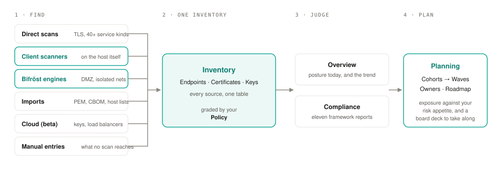
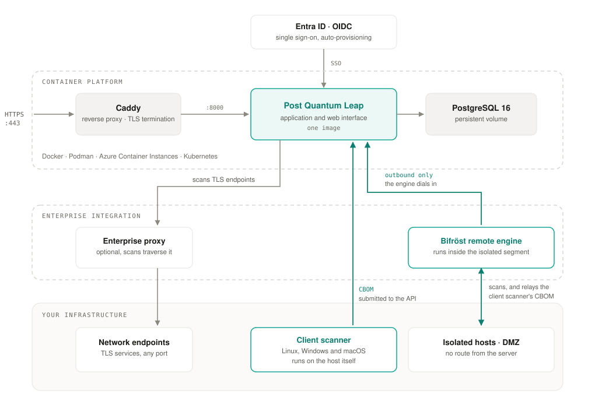

# Post Quantum Leap documentation

Three guides, in the order you will need them.

| | Guide | Read it when |
|---|---|---|
| 1 | [Installation guide](../README.md) | You are setting up the server: Docker, Podman, Windows or Kubernetes, with or without internet. |
| 2 | [Quick start](quick-start.md) | The server runs and you have a login. Thirty minutes from the first sign-in to a scanned, graded inventory. |
| 3 | [User guide](user-guide/README.md) | You want to do one specific thing: run a host scanner, read a compliance report, plan the migration, administer users. One short page per topic, with an advanced section for the detail. |

## Release notes

What changed in each release, and what to do before you upgrade:
[release notes](release-notes/README.md).

## How the product fits together

1. **Find.** Direct scans, client scanners on hosts, Bifröst remote engines in isolated networks, file imports, cloud sources and manual entries.
2. **One inventory.** Every endpoint, certificate and key in one table, graded by your own policy.
3. **Judge.** The Overview shows where you stand today. Compliance reports apply each framework's own rules.
4. **Plan.** Group the findings into cohorts, put them into dated waves with owners, and watch exposure fall against your risk appetite.

## Where it runs

The same container runs on Docker, Podman, Azure Container Instances or Kubernetes. Caddy terminates TLS in front of it, PostgreSQL holds the data. Sign-in can be federated to Entra ID or any OpenID Connect provider. Scans leave the server through your enterprise proxy where you have one. A Bifröst remote engine inside a DMZ dials out to the server and needs no inbound firewall rule; client scanners in that segment report through it.

## Support

[info@postquantumleap.com](mailto:info@postquantumleap.com). Include the version shown on the **About** page.
