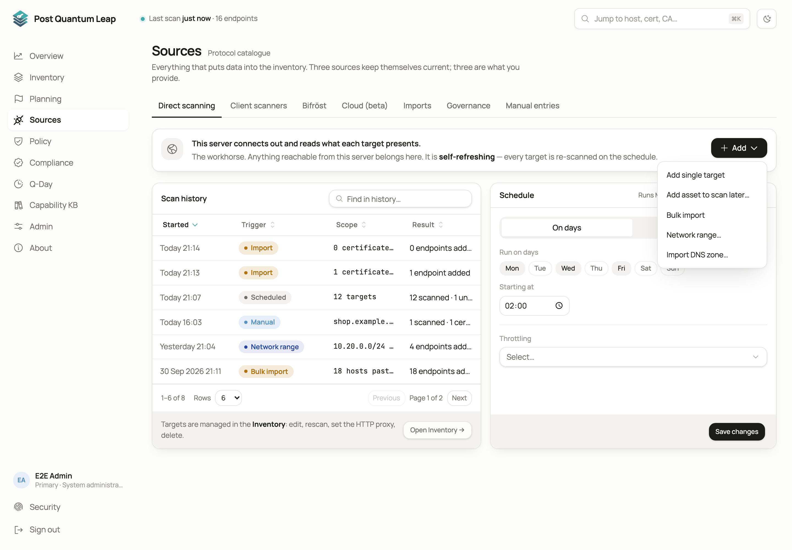
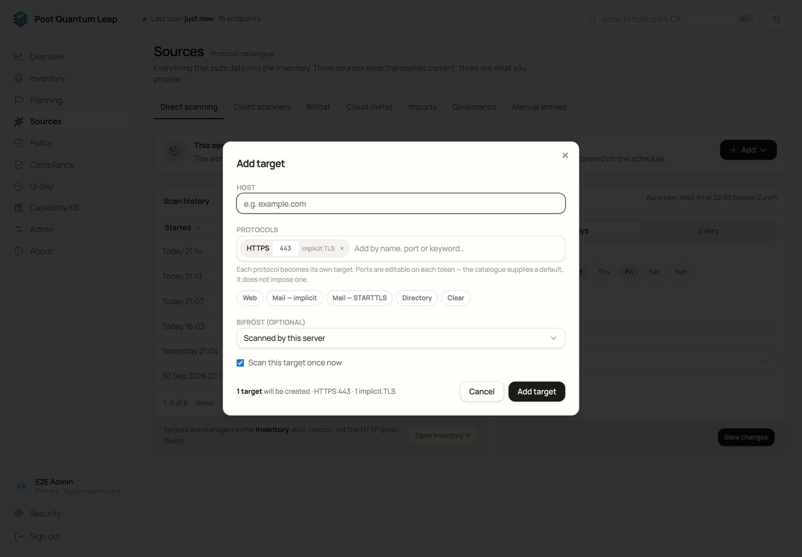
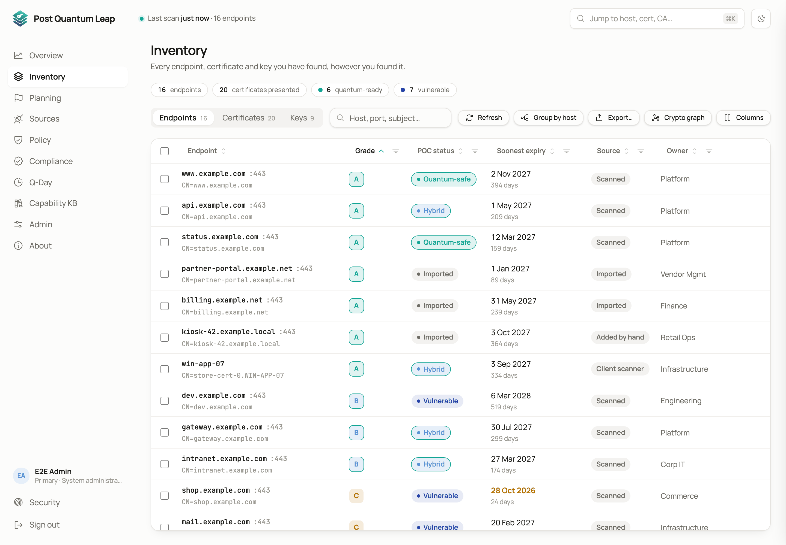
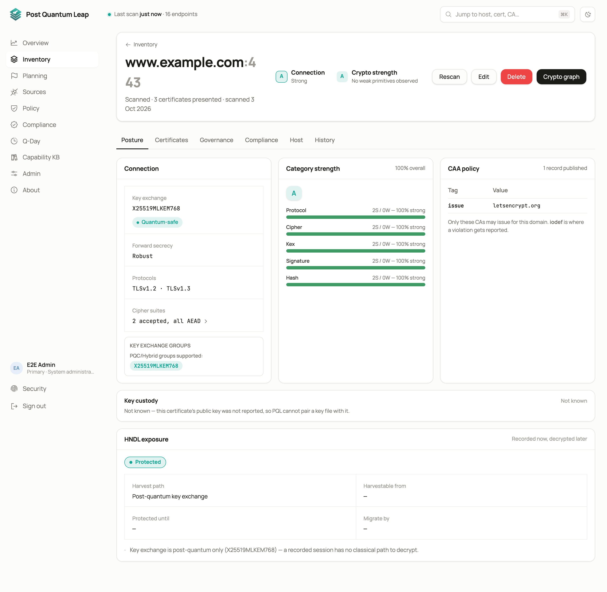
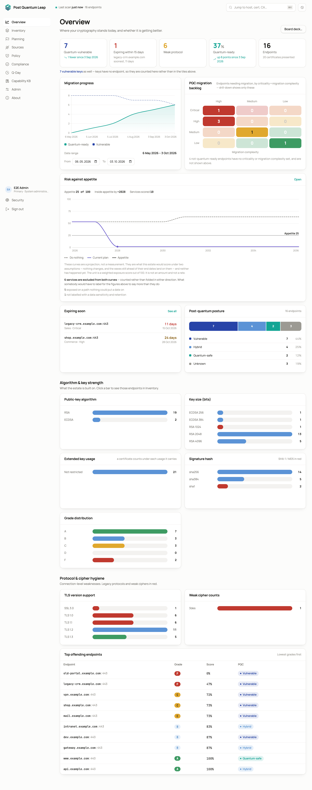
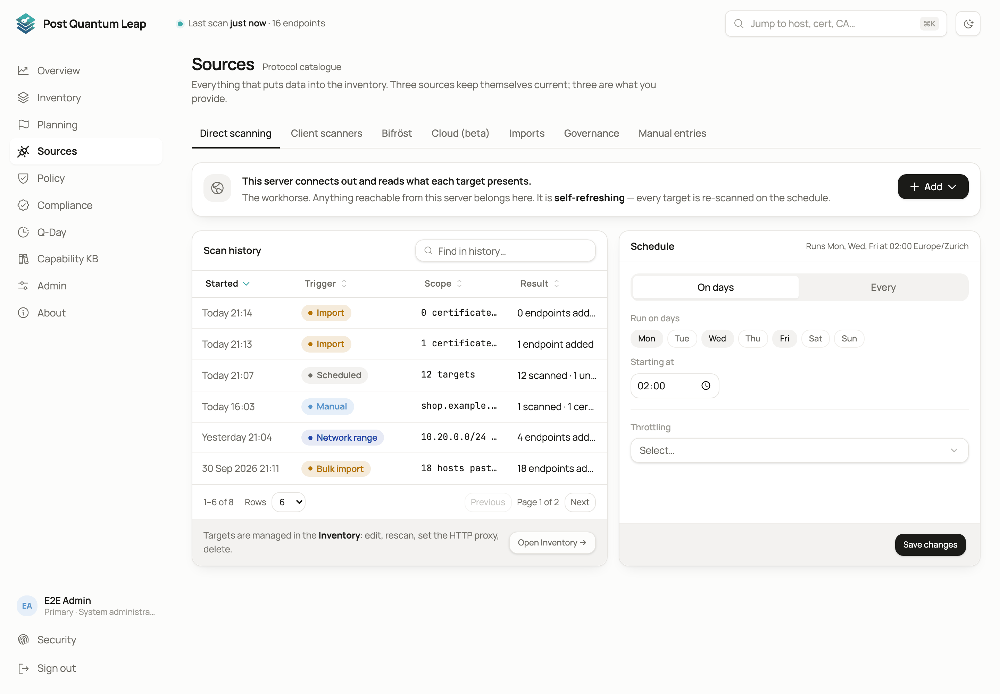
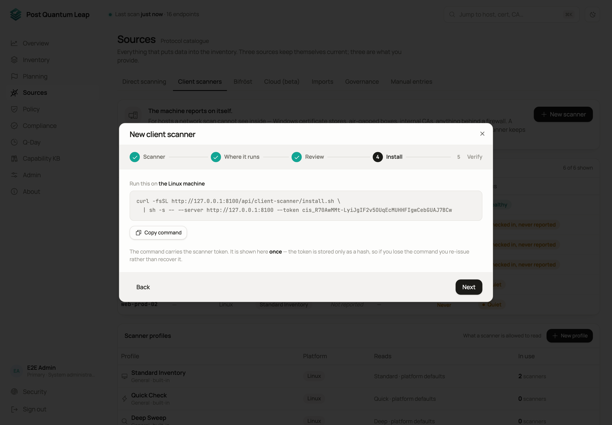
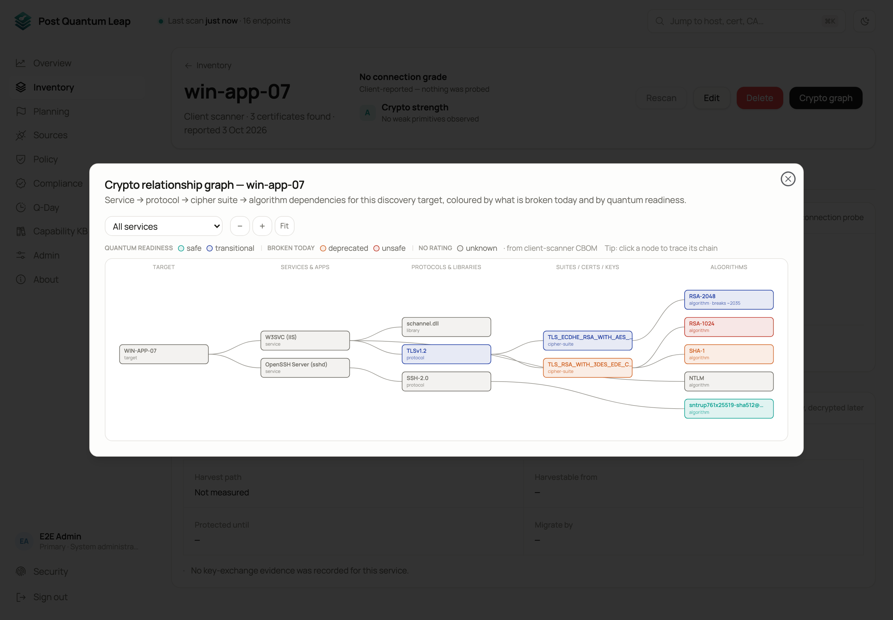
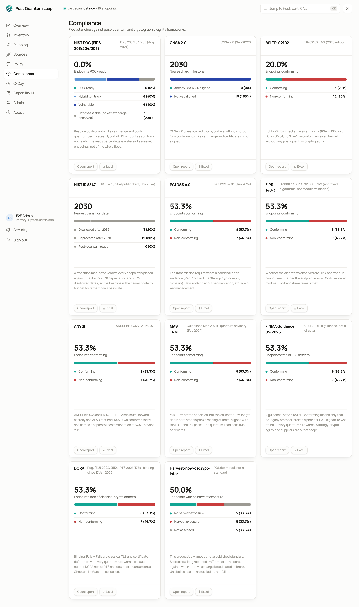
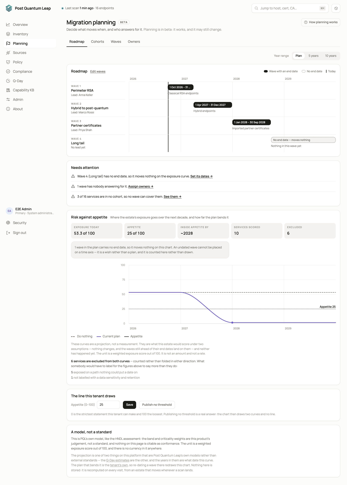

# Quick start

From your first sign-in to a scanned, graded inventory in about thirty minutes.
This page assumes the server is installed ([Installation guide](../README.md))
and somebody has sent you a sign-in link. For anything beyond the basics, the
[User guide](user-guide/README.md) has one page per topic.

**Who:** a PKI Operator or System Administrator of a tenant.

## 1. Sign in

Open the link you were sent, set a password and sign in with your e-mail address.
If passkeys are on for your installation, you are offered one after the password.
**Not now** takes you in; you can add one later under **Security**.

On your first sign-in a three-step welcome wizard opens: add a target, scan it,
review the result. Follow it, or skip it and use the steps below. You can reopen
it any time from **About → Setup guide**.

## 2. Add what to scan

Go to **Sources → Direct scanning** and open the **Add** menu.

| Choose | When |
|---|---|
| **Add single target** | One host. Enter the host name and port. |
| **Bulk import** | Paste a list of host names, one per line. |
| **Network range** | Sweep a subnet for TLS services. |
| **Add asset to scan later** | Record a host now and scan it on the schedule. |

Tick **Scan now** when you add a target and the scan starts straight away. A
small pill in the top bar shows progress while it runs.

## 3. Read the Inventory

**Inventory** lists every endpoint with its grade, post-quantum status, soonest
certificate expiry and source. Switch to **Certificates** to see one row per
certificate and how many endpoints use it.

- Type in the search box to filter by host, subject, issuer or fingerprint.
- Click the funnel in a column header to filter by that column.
- Click a row to open the endpoint or certificate.

## 4. Check the Overview

**Overview** is the home page. It shows how many endpoints are quantum-vulnerable,
expiring soon or already quantum-ready, the trend since the last scan, and the
worst-graded endpoints. Click any tile or bar to open the Inventory already
filtered to those endpoints.

## 5. Set a schedule

Back on **Sources → Direct scanning**, the **Schedule** card runs every target on
a fixed rhythm: every N hours, or on chosen weekdays at a chosen time, in your
timezone. Scheduled scans are throttled so they do not look like an attack to an
intrusion detection system.

## 6. Scan a host from the inside

A network scan sees only what a host presents on the wire. A **client scanner**
runs on the machine and reports its certificate stores, key files, SSH keys and
keystores. Nothing stays installed and no private key leaves the host.

1. **Sources → Client scanners → New scanner**.
2. Pick the platform (Linux, Windows or macOS), name the scanner and keep the default profile.
3. Choose whether you run the command on the host or from another machine over SSH or PowerShell Remoting.
4. **Create token & show commands**, then copy the one-line command and run it on the host.
5. The wizard turns green when the host reports, usually within a minute.

The host now appears in the Inventory with source **client scanner**. Open it to
see its certificates by role and its **Crypto graph**.

## 7. See your standing against a framework

**Compliance** shows one card per framework: NIST PQC, CNSA 2.0, BSI TR-02102,
NIST IR 8547, PCI DSS 4.0, FIPS 140-3, ANSSI, MAS TRM, DORA and FINMA 05/2026,
plus a harvest-now-decrypt-later view. Each card says what it measures, and
**Open report** lists every endpoint with the rule that decided its verdict.

## 8. Start a plan

**Planning → Waves → Let PQL draft it** proposes cohorts (groups of services
that move together) and puts them into dated waves, most exposed first. Nothing
is saved until you tick what you want and apply it. The **Roadmap** then shows
the waves on a timeline and your exposure against the risk appetite you set.

## What next

| You want to | Read |
|---|---|
| Add people and give them roles | [Admin](user-guide/13-admin.md) |
| Scan a network the server cannot reach | [Bifröst remote engines](user-guide/07-remote-engines.md) |
| Change what counts as a good grade | [Policy](user-guide/08-policy.md) |
| Import certificates from files | [Sources](user-guide/04-sources.md) |
| Record owners and criticality | [Governance attributes](user-guide/12-governance.md) |
| Read keys from Google Cloud or Azure | [Cloud discovery](user-guide/11-cloud-discovery.md) |
| Replace the server's own certificate | [Platform console](user-guide/14-platform-console.md) |
