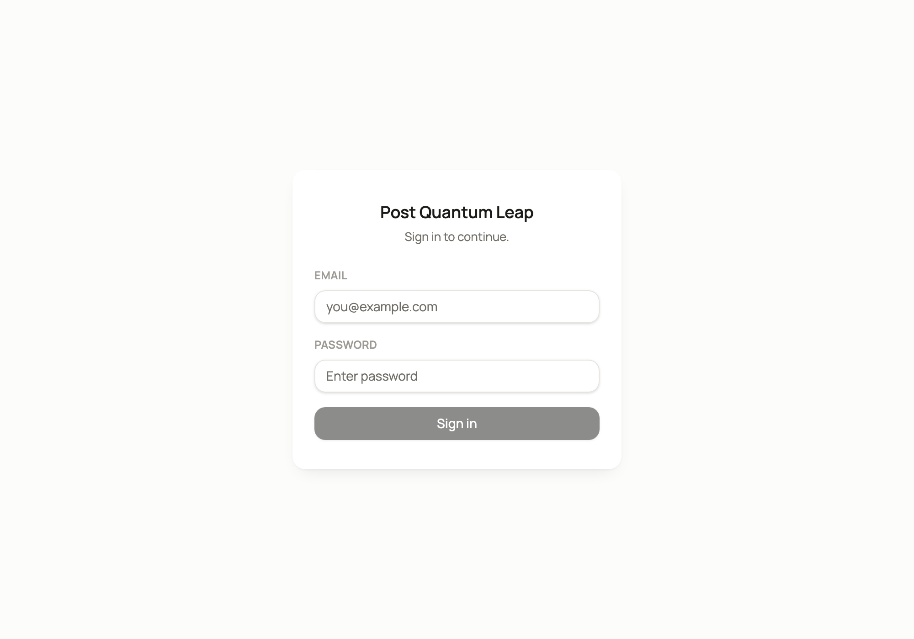
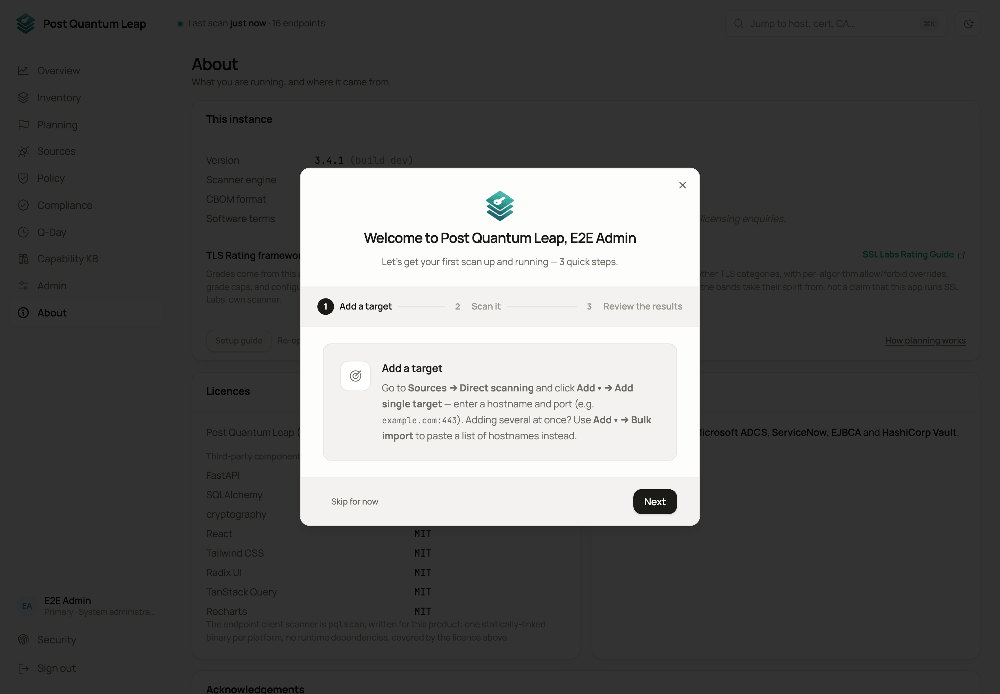

# Signing in and roles

How you get in, what a tenant is, and what each role may do.
**Who:** everyone.

## Signing in

Open the installation's address and sign in with your e-mail address and
password. The first time, you use the one-time setup link an administrator sent
you and choose a password there. If your organisation uses single sign-on, click
your provider's button instead.

If you belong to several tenants, you pick one after your password is accepted.
Inside, the **tenant switcher** above your name in the left rail changes which
one you are working in.

## Tenants

One installation hosts one or more tenants. Each has its own inventory, members
and settings, and none can see another's data.

## Roles

Three roles, each held within one tenant. Each includes everything the one before it can do.

| Role | Can do |
|---|---|
| **Reader** | View the Overview, Inventory, Compliance, Planning and detail pages. Export the filtered inventory. |
| **PKI Operator** | Add and edit endpoints, run scans, import certificates, record manual entries, set up client scanners and Bifröst remote engines, edit governance attributes, plan. |
| **System Administrator** | Manage this tenant's members, open **Admin**, edit the scan schedule and **Policy**, manage scanner tokens and binaries, connect cloud sources. |

Separately, a **platform administrator** runs the whole installation: tenants,
administrators, TLS, licence and single sign-on. This is a flag, not a fourth
role. It cannot be granted from inside a tenant, and it opens the
[Platform console](14-platform-console.md).

People who sign in through single sign-on for the first time become **Reader**.
An administrator can promote them afterwards.

## Passkeys in brief

A passkey signs you in with your fingerprint, face, device PIN or a security key.
It appears only when the installation has passkeys turned on. After a password
sign-in you are asked to **Set up a passkey**; **Not now** takes you in. You can
add one at any time under **Security**.

If your installation requires passkeys, setting one up ends with ten
**recovery codes**. Keep them somewhere you can reach without that device.
Everything else about passkeys, recovery codes and security notices is in
[Passkeys and recovery codes](advanced/passkeys-and-recovery.md).

## The welcome wizard

On your first sign-in a three-step wizard opens: add a target, scan it, review
the result. **Skip for now** closes it. Reopen it any time from
**About → Setup guide**.

## See also

- [Quick start](../quick-start.md)
- [Your account](15-your-account.md)
- [Admin](13-admin.md) for adding people
