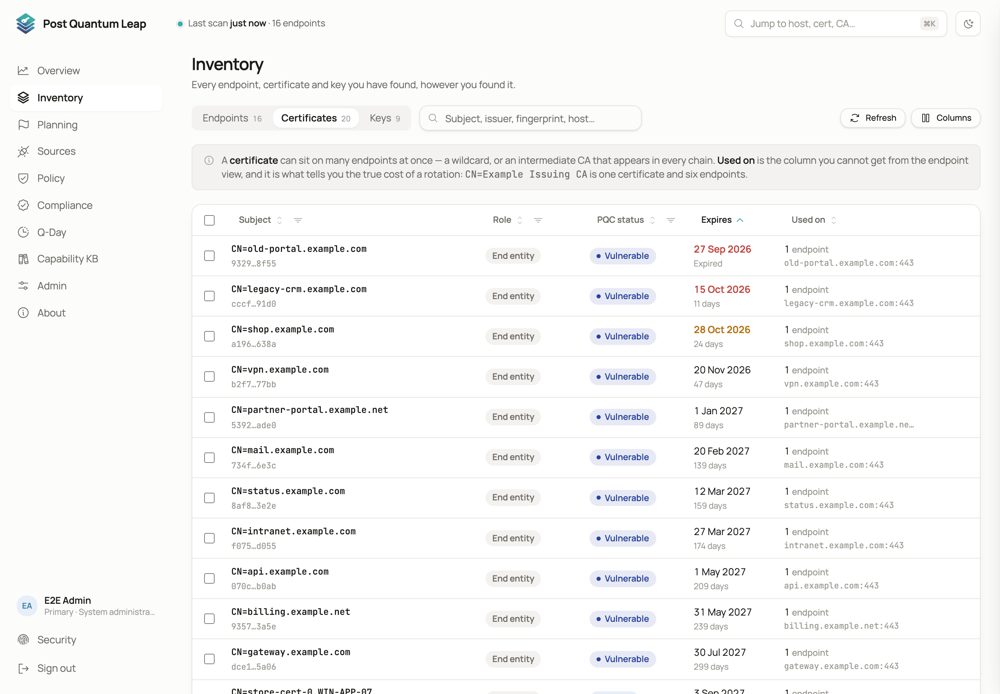
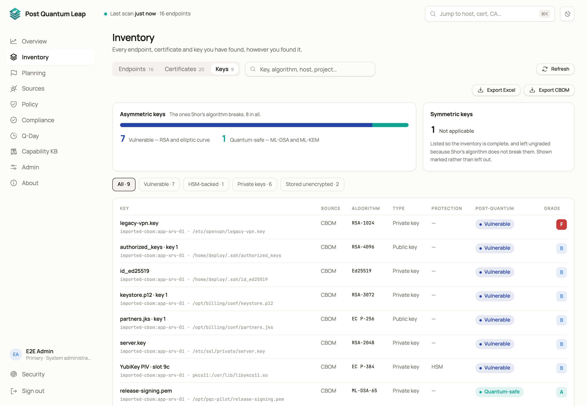
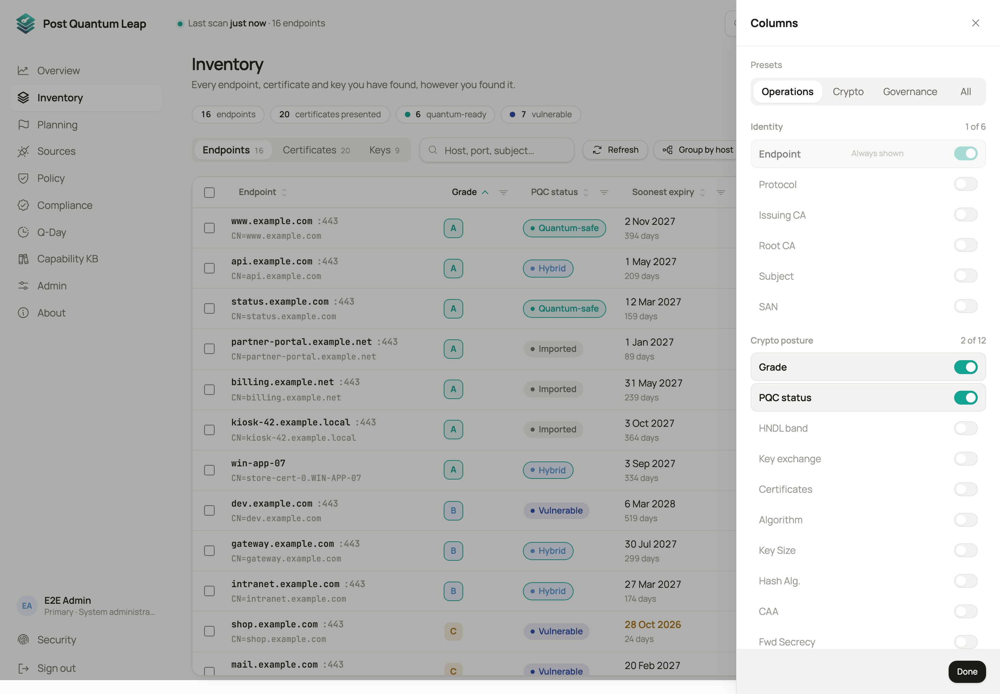
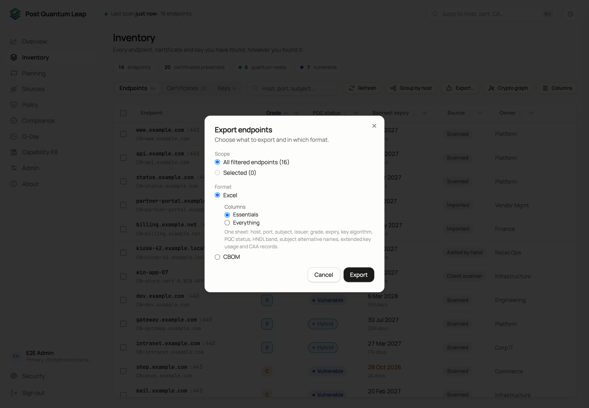

# The Inventory

Every endpoint, certificate and key you have found, however you found it, in
one table.
**Who:** every signed-in role. Scans, edits and bulk actions need PKI Operator.

## Three views

A switch above the table chooses what each row is.

| View | One row per | Why you use it |
|---|---|---|
| **Endpoints** | Host | Grade, post-quantum status, soonest expiry, source, owner. The everyday view. |
| **Certificates** | Distinct certificate | The **Used on** count: how many endpoints present it. That is the blast radius of a rotation. |
| **Keys** | Key read by a client scanner or a cloud source | Where the key is stored, its algorithm, whether it sits in hardware, its grade. |

## Finding things

- **Search.** The box filters by host, port, subject, issuer or fingerprint.
- **Column filters.** Each filterable column has a funnel in its header. Open it to narrow by grade, post-quantum status, source, expiry, algorithm, key size, hash, protocol, cipher, SAN, subject, CAA, reachability, forward secrecy, root or issuing CA, and every governance attribute. The CA filters offer the names already in your fleet as you type.
- **The URL carries the filters.** Any filtered view can be bookmarked or sent to a colleague, and every drill-down from the Overview lands here pre-filtered.

## Choosing columns

**Columns** opens a drawer where you pick what the table shows. Three
one-click views, **Operations**, **Crypto** and **Governance**, each select a
set of columns. Change anything and the picker reads *Custom*. Your choice is
remembered in this browser.

## Acting on rows

Tick one or more rows and the bulk bar appears.

| Action | What it does |
|---|---|
| **Rescan** | Runs a fresh scan of the ticked endpoints. The scan reads protocols, ciphers, forward secrecy, the certificate chain and post-quantum key exchange. |
| **Set proxy** | Routes future scans of these endpoints through one of the HTTP proxies defined under Admin. |
| **Set remote engine** | Hands these endpoints to a Bifröst remote engine. |
| **Edit** and **Delete** | Change or remove a single endpoint from its row menu. |

Adding endpoints is done on [Sources](04-sources.md), not here.

## Export

**Export…** opens a wizard. Choose the scope, *All filtered* or *Selected*, and
the format.

| Format | For |
|---|---|
| **Excel** | Reporting and offline analysis. |
| **CBOM** | A CycloneDX cryptographic bill of materials for other tools. Manual entries are left out unless you tick **Include manual entries**. |

The Certificates view has its own direct Excel export.

## Where a row came from

The **Source** column says how PQL knows about a row.

| Source | Meaning |
|---|---|
| **Scanned** | A network scan measured it. |
| **Client scanner** | A scanner running on the host reported it. |
| **Imported** | Read from a certificate or CBOM file you uploaded. |
| **Declared (cloud)** | A cloud source read it from configuration. No scan has measured it yet. |
| **Entered manually** | A person typed it in. Nothing has ever measured it. |

Everything except the last was measured by something. An entered row is a
statement, and it is labelled that way everywhere.

## Scan errors

A target that cannot be reached shows a clear **DNS** or **Timeout** state
instead of a grade. Rescan it, or route it through a proxy or a Bifröst
remote engine.

## See also

- [Endpoint and certificate pages](05-detail-pages.md)
- [Sources](04-sources.md)
- [Governance attributes](12-governance.md)
