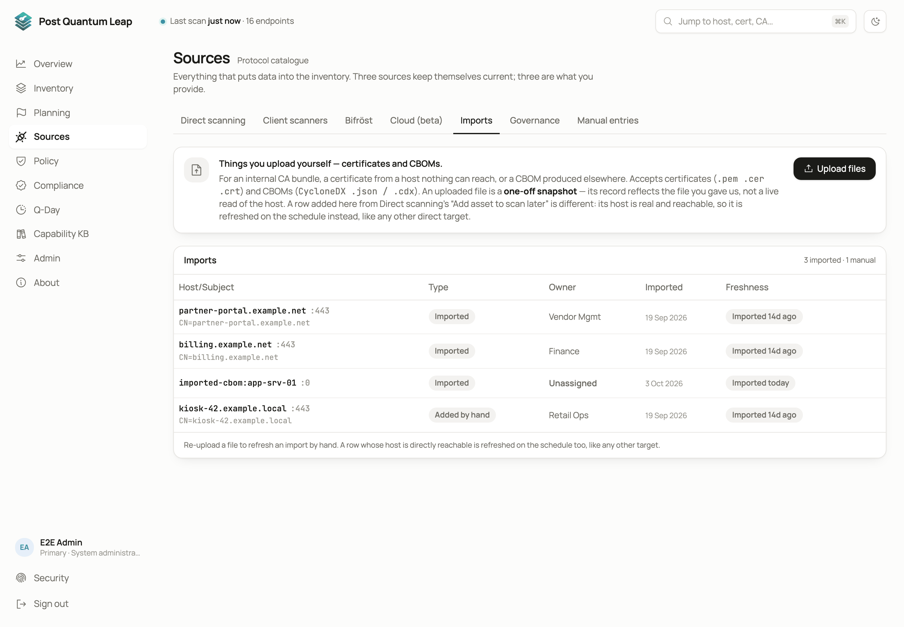
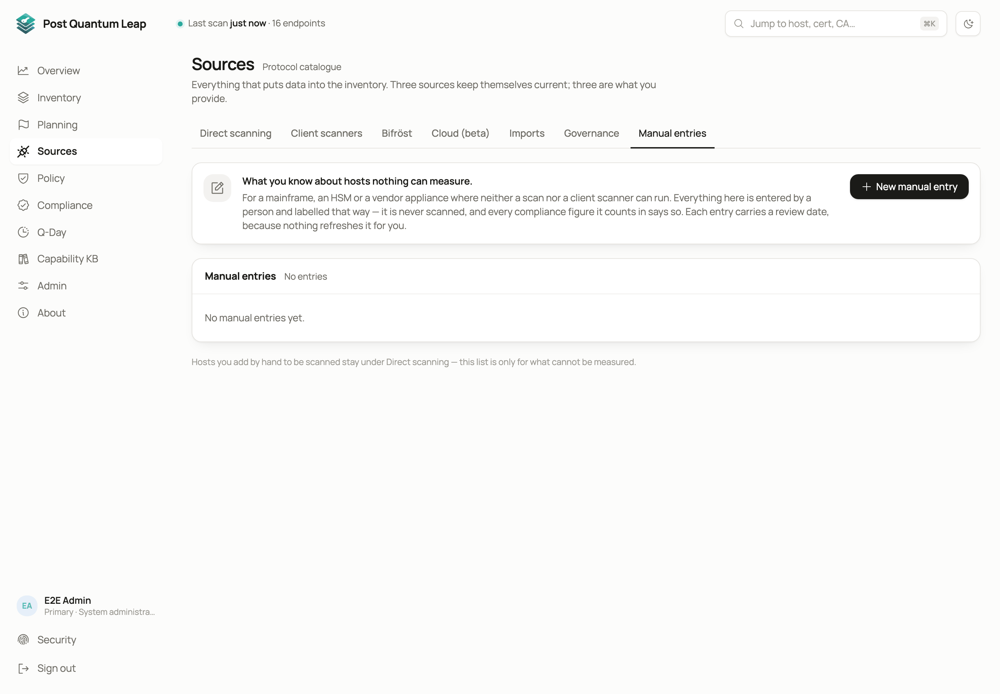
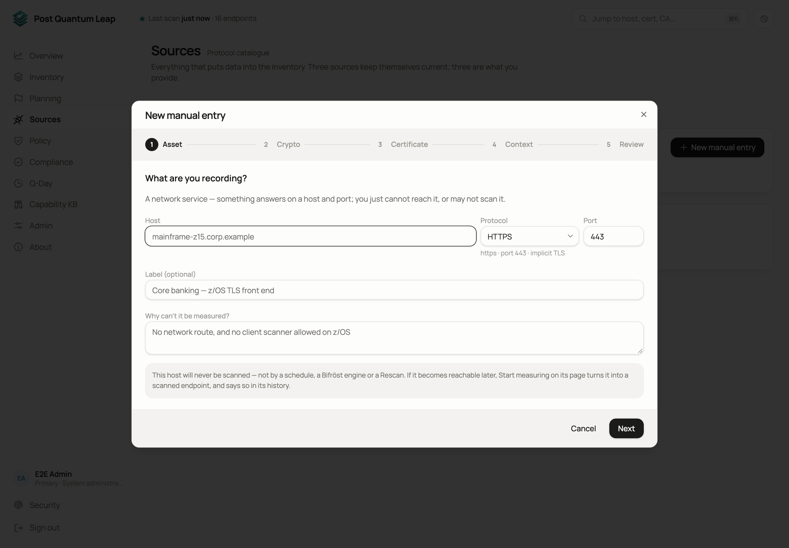

# Sources

Everything that puts data into the inventory. Three sources keep themselves
current (direct scans, client scanners, cloud); three are what you provide
(imports, manual entries, governance sheets).
**Who:** PKI Operator to add targets, run scans and import. System
Administrator to edit the schedule.

| Tab | What it does | Page |
|---|---|---|
| **Direct scanning** | Add targets, scan them, set the schedule, read the scan history | this page |
| **Client scanners** | Scan a host from the inside | [Client scanners](06-host-scanners.md) |
| **Bifröst** | Scan networks the server cannot reach | [Bifröst remote engines](07-remote-engines.md) |
| **Cloud (beta)** | Keys and TLS front ends from Google Cloud and Azure | [Cloud discovery](11-cloud-discovery.md) |
| **Imports** | Certificate and CBOM files | this page |
| **Governance** | Owners and attributes in bulk through Excel | [Governance attributes](12-governance.md) |
| **Manual entries** | Assets nothing can measure | this page |

## Adding targets

On **Direct scanning**, the **Add** menu offers four ways in.

| Choice | Use it for |
|---|---|
| **Add single target** | One host and port. Tick **Scan now** to scan it immediately. |
| **Bulk import** | A pasted list of host names, one per line. |
| **Network range** | A subnet and port to sweep. Every host that answers becomes a target. |
| **Add asset to scan later** | A host you know is reachable, scanned on the schedule or by a later Rescan rather than now. |

A target can carry an **HTTP proxy** and a **Bifröst remote engine**. Leave both
empty and the server scans it directly. Change them later from the Inventory.

## Scanning

- **Scan all targets** runs everything now.
- **Rescan** on the Inventory runs the ticked endpoints.
- The top bar shows progress while a scan runs.

Recurring scans use throttling that keeps them from looking like an attack to
an intrusion detection system. The throttling profiles are defined under
[Admin](13-admin.md).

## The schedule

The **Schedule** card runs every target on a rhythm: every N hours, or on
chosen weekdays at a chosen time. The schedule stores a timezone, taken from
your browser when you save, so the next run time is unambiguous wherever the
server runs.

## Scan history

One row per completed run: scheduled scan, manual scan, network-range sweep,
bulk import or certificate import, with its trigger, scope and result. A live
row shows the run in progress. Expand a network-range row to see probes sent,
hosts reached, hosts blocked by the destination policy and targets added.

## Importing certificates and CBOMs

Not everything can be scanned. **Imports → Upload files** takes certificate
files (`.pem`, `.cer`, `.crt`) and CycloneDX CBOM files (`.json`, `.cdx`). Each
file is parsed and previewed before you commit it. You can scan the new asset
straight away.

An import is a snapshot of the file, not a live read of the host. Upload the
file again to refresh it.

## Manual entries

Some assets will never be scanned: an HSM behind an air gap, a mainframe front
end with no route from the server, a supplier's endpoint you answer for. A
manual entry records what you know and labels it **Entered manually**
everywhere, so nobody mistakes it for a measurement.

**New manual entry** opens a five-step wizard.

1. **Asset.** Host, protocol, port, and why it cannot be measured. The reason is shown on its page.
2. **Crypto.** The facts you know: TLS versions, key-exchange groups, forward secrecy. You enter facts, never verdicts. PQL computes the post-quantum status, grade and compliance verdicts the same way it does for a scan.
3. **Certificate.** Paste a PEM, or type the certificate's fields. Either can be skipped.
4. **Context.** Governance attributes and a **Review by** date. Nothing refreshes an entry, so somebody confirms it by that date. The wizard proposes six months.
5. **Review.** The computed result, before you save.

A manual entry is never dialled by anything: not the schedule, not Scan all,
not a Rescan, not an engine, not network discovery. If the host is reachable,
add it as a target instead.

Entries count in your compliance figures, and every figure that includes one
says so ("includes 4 entered manually"). If an entry becomes reachable one day,
open its page and press **Start measuring**: it becomes an ordinary target
waiting for its first scan.

## Which one do I use

| You want to | Use |
|---|---|
| Scan a host PQL can reach | **Add single target** |
| Record a reachable host and scan it later | **Add asset to scan later** |
| Bring certificates in from a file | **Imports** |
| Record something nothing can measure | **Manual entries** |
| See what is on a server, not only what it presents | [Client scanners](06-host-scanners.md) |
| Scan a network the server cannot reach | [Bifröst remote engines](07-remote-engines.md) |

## See also

- [The Inventory](03-inventory.md)
- [Admin](13-admin.md) for proxies and throttling profiles
