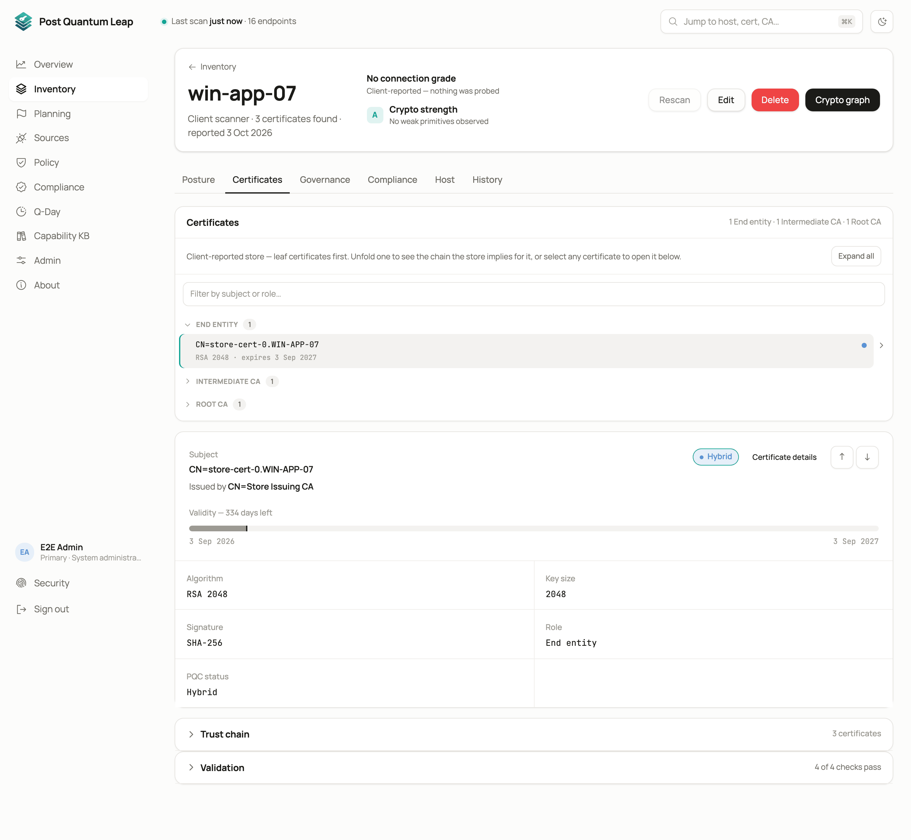
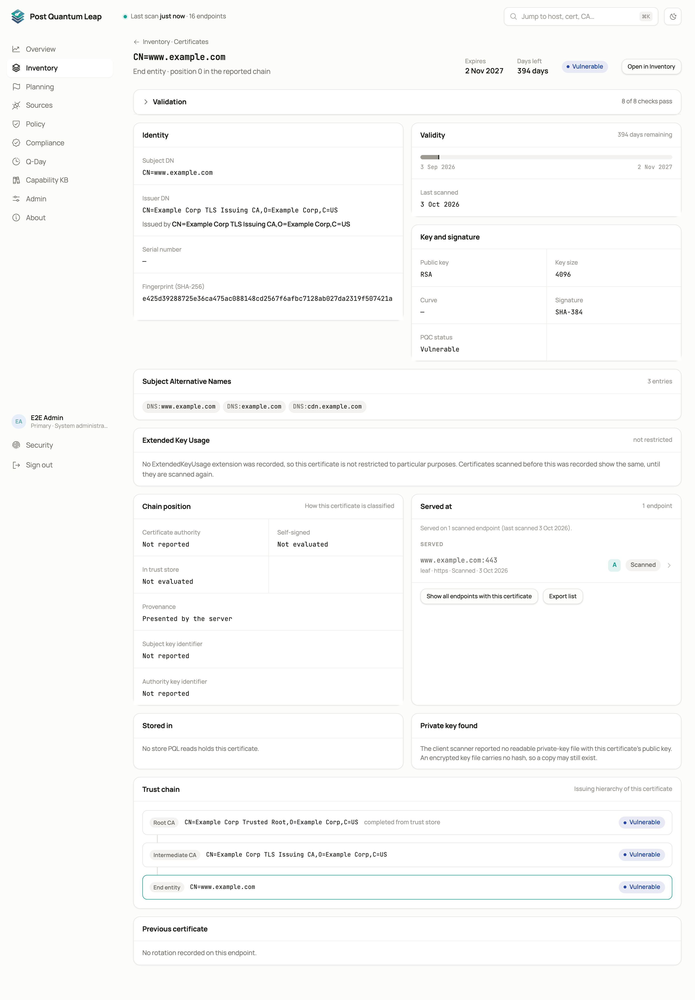

# Endpoint and certificate pages

Click any row in the Inventory to open its page.
**Who:** every signed-in role. Editing and acknowledging need PKI Operator.

## An endpoint's page

One host, with everything PQL knows about it.

- **Posture.** The connection grade and what produced it: protocols, ciphers, forward secrecy, key exchange. For a service a cloud source declares, a card compares the configuration with what the scan saw.
- **Certificates.** For a network endpoint, the chain the server presented. For a client-scanner host, every certificate found on the machine, grouped by role: end entity, intermediate CA, root CA, self-signed.
- **Governance.** Owner, criticality and your other attributes. They belong to the endpoint and survive certificate rotation.
- **History.** Every scan of this endpoint.
- **Compliance.** This endpoint's verdict under each framework.

A client-scanner host also carries its **CBOM summary**: counts by asset type
and post-quantum category, the profile used, an overall readiness score, and a
button to the **Crypto graph** ([Client scanners](06-host-scanners.md)).

The crumb at the top takes you back to where you came from, including a
compliance report you were checking.

## A certificate's page

- **Subject, issuer, validity, key, signature hash, role** and its post-quantum status (judged by its signature).
- **Subject Alternative Names.** Every name the certificate covers. The Inventory's SAN filter searches these.
- **Trust chain.** The issuing hierarchy, root at the top. When a server did not send its root, PQL completes the chain from the bundled Mozilla trust store and labels that node **completed from trust store**, so it is never mistaken for one the server sent.
- **Served at.** Every endpoint that presents this certificate, measured ones first, then front ends a cloud source reads that are configured with it.
- **Stored in.** Every store that holds it: a Key Vault, an App Service, an Application Gateway, a Google Cloud certificate, or a host store a client scanner read.
- **Private key found.** Key files a client scanner reported with this certificate's public key.

## Key custody and reach

Two short cards say where the private key lives (**HSM**, **Software store**,
**Held by the platform**, **Key file** or **Not known**) and how far the
certificate is known to be in use. *Not seen in use* is a hint to look, never a
reason to delete. The rules behind both are in
[Cloud configuration compared with scans](advanced/configuration-vs-scan.md).

## Acknowledging a finding

When a cloud source says a front end is configured with one certificate and a
scan sees another, the endpoint page reports a finding. If you know why (a
CDN in front, TLS inspection on the path), a PKI Operator can **Acknowledge** it
with a note. The acknowledgement ends by itself when the endpoint or the
configuration changes, or after 90 days. Details in
[Cloud configuration compared with scans](advanced/configuration-vs-scan.md).

## See also

- [The Inventory](03-inventory.md)
- [Governance attributes](12-governance.md)
