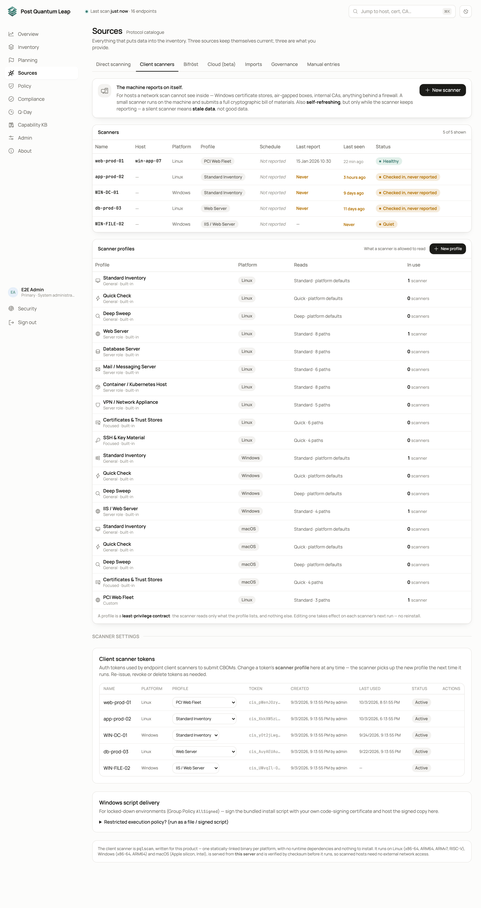
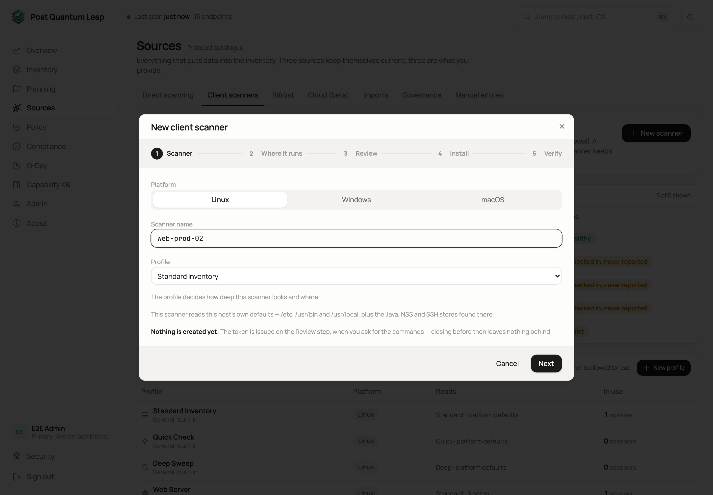
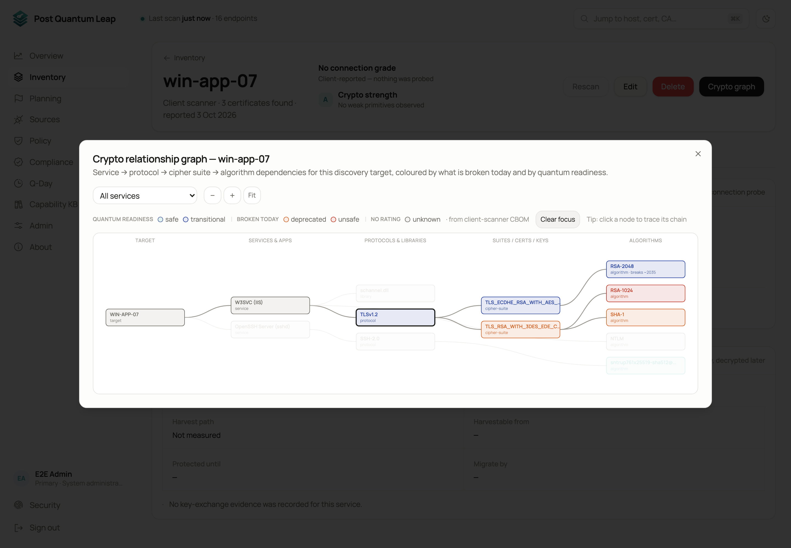

# Client scanners

A network scan sees only what a host presents on the wire. A client scanner
runs on the machine itself and reports everything cryptographic it finds:
certificates, private key files, SSH keys, keystores, services, protocols,
cipher suites and crypto libraries. It submits a CycloneDX CBOM
(cryptography bill of materials) to PQL. No private key ever leaves the host.
**Who:** PKI Operator to set up and run scanners. System Administrator for
profiles, tokens, binaries and signed scripts.



## What it is

- One statically linked binary for Linux (x86_64, arm64, armv7, riscv64), Windows (amd64, arm64) and macOS. No runtime, no shared libraries, no installer.
- Downloaded from your PQL server, never from the internet. Scanned hosts need no external network access.
- Its checksum is verified before it runs. On a mismatch it refuses to run.
- Nothing stays on the machine. The binary is removed on every exit, including Ctrl-C. A single run is a snapshot; add a schedule to keep the host reporting.

## Running your first scan

**Sources → Client scanners → New scanner** opens a five-step wizard.



1. **Scanner.** Pick the platform (Linux, Windows or macOS), name the scanner and choose a profile. Each platform pre-selects its own *Standard Inventory*. Nothing is created yet.
2. **Where it runs.** On the host itself, or from another machine: over SSH for Linux and macOS (with **Run with sudo** on by default so root-only keys are read) or over PowerShell Remoting for Windows. The target host, not your jump host, must reach the PQL server or the relay you choose under **Run via**.
3. **Review.** Check your answers, then press **Create token & show commands**. This issues the token.
4. **Install.** The command with the real token embedded, shown once. Copy it and run it on the host.
5. **Verify.** The wizard polls and turns green once the host reports, usually within a minute. Add a schedule here if the host should keep reporting.


The one-line commands look like this.

Linux and macOS:

```sh
curl -fsSL https://<server>/api/client-scanner/install.sh | sh -s -- \
    --server https://<server> --token cis_XXXXXXXX...
```

Windows, in an elevated PowerShell:

```powershell
$env:CIS_SERVER='https://<server>'; $env:CIS_TOKEN='cis_XXXXXXXX...'
irm https://<server>/api/client-scanner/install.ps1 | iex
```

Closing the wizard before the host has reported asks whether to **Keep** the
token (it waits as *Quiet* in the table) or **Discard** it.

## Profiles

Every scan runs under a profile that says how deep to look and where.

| Depth | Reads | Takes |
|---|---|---|
| **Quick** | Certificates, keys, keystores, service configuration | Seconds |
| **Standard** | The above, plus libraries, packages, processes | Seconds to a minute |
| **Deep** | The above, plus every user profile, application directory and all of `/usr`, `/opt` or Program Files | Minutes |

Eighteen profiles ship: general ones (*Standard Inventory*, *Quick Check*,
*Deep Sweep*) for each platform, server roles (web, database, mail, container
host, VPN appliance, IIS) and focused ones (certificates and trust stores, SSH
and key material). A System Administrator can duplicate a built-in profile and
change its depth and paths. Profiles are explained in
[Client scanners in detail](advanced/host-scanner-details.md).

## Reading the results

The host appears in the Inventory with source **client scanner**. Its page
shows the CBOM summary: counts by asset type and post-quantum category, the
profile used and an overall readiness score. Certificates found on a host are
independent certificates, not a chain, so each is classified by its role: root
CA, intermediate CA, self-signed or certificate.

**Crypto graph** draws the dependencies in columns: host, services, protocols,
cipher suites and certificates, algorithms. Every node is coloured by its
post-quantum rating. Click a node to trace its chain; everything else dims.




Run the scanner again and the same host is updated in place. Network scans
never touch a client-scanner host.

## The scanners table

One row per scanner: name, platform, profile, last seen, status. The row menu
offers **Change profile**, **Re-issue**, **Revoke** and **Delete**. A scanner
is a token: use one per host. Each token is tied to the first host it reports
for and can update only that host afterwards.

## Keeping a host reporting

The **Verify** step prints a schedule command for your platform, with the
server, token and profile filled in. Choose **Daily**, **Twice a day**,
**Every 6 hours** or **Weekly**. The commands, what each platform does when it
missed a run, and how to remove a schedule are in
[Client scanners in detail](advanced/host-scanner-details.md).

## See also

- [Client scanners in detail](advanced/host-scanner-details.md): profiles, Windows specifics, restricted execution policies, schedules, tokens
- [Bifröst remote engines](07-remote-engines.md): when the host cannot reach the server
