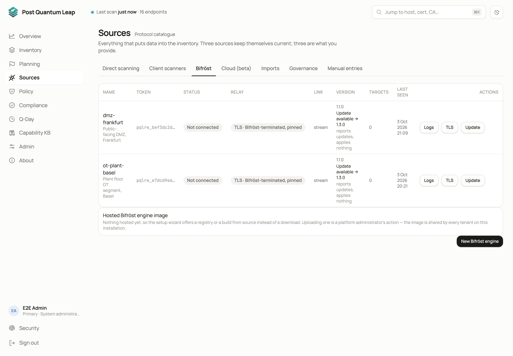
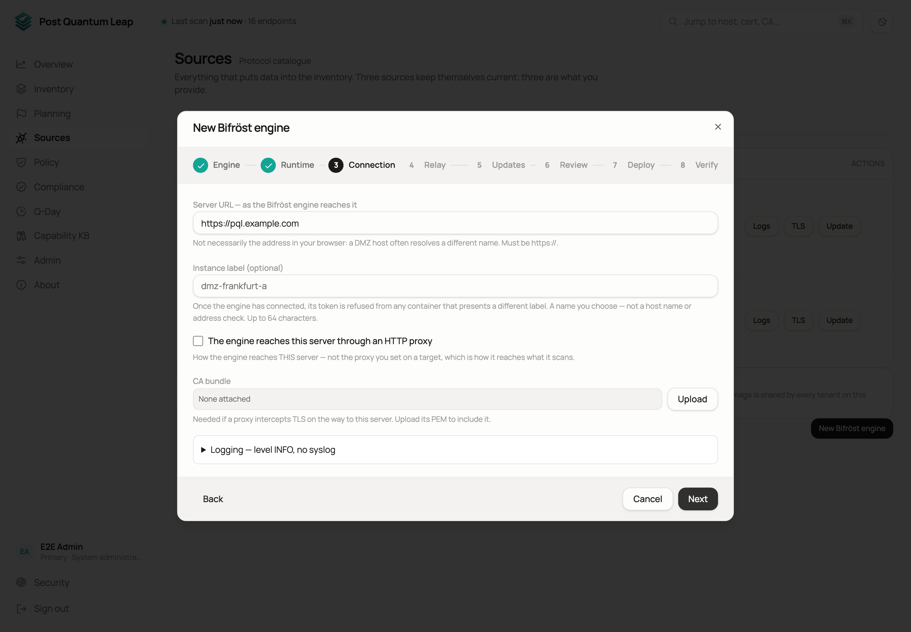

# Bifröst remote engines

Some of your estate sits where the server cannot connect: a DMZ, an OT segment,
a branch office behind its own firewall. A Bifröst remote engine is a small
container you run inside that network. It dials PQL, takes scan work, runs it
where it can reach the targets, and sends the results back.
**Who:** PKI Operator to set one up and give it work. System Administrator to
re-issue, revoke, delete or push TLS material.

## Why it needs no firewall change

Nothing ever connects to the engine. It opens one outbound connection to PQL
and receives its work down that connection. PQL has no address for it and
never dials in.

An engine can also act as a **relay**: client scanners on hosts in that segment
report to the engine, and the engine carries their results to PQL. Those hosts
need no path out of the segment either.

## Setting one up

**Sources → Bifröst → New Bifröst engine** opens an eight-step wizard. Nothing
is created until step 6.

1. **Engine.** Name it after the network it will live in, not the machine.
2. **Runtime.** Docker, Podman or Kubernetes; a compose file or a single run command; the host's architecture; where the image comes from (your PQL server, your own registry, or a build of your own).
3. **Connection.** The **server URL** is how the container reaches PQL, which is often not what you see in your browser. Get this wrong and the engine never connects and says nothing. Then an outbound proxy and its CA bundle if the segment has one, an instance label, and logging.
4. **Relay.** Off unless client scanners in that segment should report through the engine. On: the port, the address those hosts dial, the interface to publish it on, and how its TLS is terminated.
5. **Updates.** Do nothing, notify (the default), or update automatically inside a window.
6. **Review.** Every answer on one screen. **Create engine & token** creates it.
7. **Deploy.** The commands and files for your runtime. For Docker and Podman: the image command, the start commands and a package to download (compose file, `.env`, a systemd unit and a README). For Kubernetes: the Secret command, the image mirror, a generated `values.yaml` and `helm install`. The token is shown only here. Copy or download before you leave; the wizard asks before letting you close.
8. **Verify.** Waits for the engine to connect. Optional.

On the engine host, run what **Deploy** printed, then read the first twenty
lines of the container's log. They say what configuration the engine thinks
it has and whether each step of connecting worked.

## Giving it work

| Scope | How |
|---|---|
| One target | The **Remote engine** field in the target editor, next to **HTTP proxy**. Empty means the server scans it. |
| Several | Tick them in the Inventory and use **Set remote engine**. |
| A whole subnet | Point **Network range** at the engine. Often the reason to deploy one. |

## Reading the table

| Column | Tells you |
|---|---|
| **Status** | Connected, not connected, never connected, revoked, expired. Comes from the engine's own connection; PQL never probes it. |
| **Link** | `stream` is normal. `polling fallback` means something between the engine and PQL, usually a proxy, is interfering. Scanning still works, dispatch is slower. |
| **Version** | The engine's build and the fingerprint of its scanning code. If the fingerprint differs from the server's, the engine measures with older code. |
| **Targets** | How many services this engine scans. Check before you delete one. |

*Too old, receiving no work* is the state to act on: that engine is handed
nothing until it is updated.

## When something goes wrong

- **Logs.** One click from the engine's row, filterable by level and by job. Credentials are masked.
- **Server URL.** The most common cause of an engine that never connects. It must be reachable from inside the container.
- **An engine that stops answering.** Its queued work waits one hour, then those targets are recorded as *remote engine did not respond*. PQL never scans them from the server instead.
- **Two kinds of proxy.** An HTTP proxy on a target is how a scanner reaches that target. An engine's uplink proxy is how the engine reaches PQL. One engine can have both.

Updates, re-issuing the credential, deleting an engine and the relay are in
[Bifröst remote engines in detail](advanced/remote-engine-details.md).

## See also

- [Client scanners](06-host-scanners.md)
- [Bifröst remote engines in detail](advanced/remote-engine-details.md)
