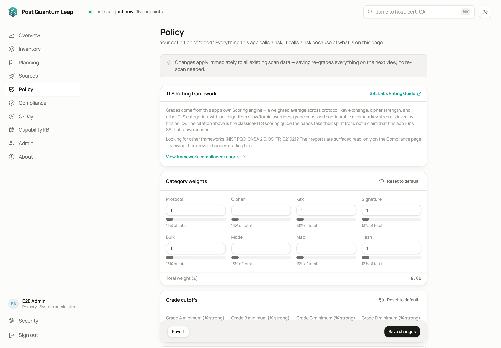

# Policy

The policy defines what "good" means for your organisation: which grades count
as compliant, which algorithms and protocols are strong or weak, and what a
compliant post-quantum posture is. Every grade and badge in the product is
tinted by it.
**Who:** every role can view it. System Administrator to change it.

## Grading presets

A switch picks the baseline the grade is computed from.

| Preset | What it does |
|---|---|
| **SSL Labs compatible** (default) | Mirrors the SSL Labs rating. Classical key exchange is not penalised on its own. Legacy static-RSA key exchange or CBC ciphers only cost you when no modern alternative is offered alongside. |
| **PQC-strict** | The stricter baseline. An otherwise modern endpoint with no post-quantum or hybrid key exchange scores lower. |

Grade and post-quantum status stay two separate signals. A clean grade never
implies quantum readiness; read the PQC badge for that.

Switching preset changes every rule's baseline at once. Overrides you made
(below) are kept and applied on top.

## Algorithm rules

Below the switch is the full rule table for every protocol, cipher,
key-exchange group and signature hash the engine knows, grouped by category,
with a search box and category chips. Every row is editable:

| Setting | Effect |
|---|---|
| **Default** | Use the preset's own call. |
| **Allow** | Treat as acceptable. |
| **Forbid** | Treat as weak, with an optional cap on the grade. |

There is no "add rule" step. Every algorithm already has a row.

## Weights and expiry thresholds

Further down, set how much each category (protocol, cipher, key exchange,
certificate) contributes to the overall grade, and the **warn** and
**critical** day thresholds for expiring certificates. The Overview's
"expiring soon" tile reads these.

## Changes apply at once

Grades are computed live from the saved policy, not stored at scan time. Save
a change and every existing scan is re-graded the next time it is shown. No
rescan needed.

## Policy and compliance are different things

The policy is yours. The [Compliance](09-compliance.md) reports apply each
framework's own rules and ignore your policy, so their numbers can differ
from your grades.

## See also

- [The Overview](02-overview.md)
- [Compliance](09-compliance.md)
