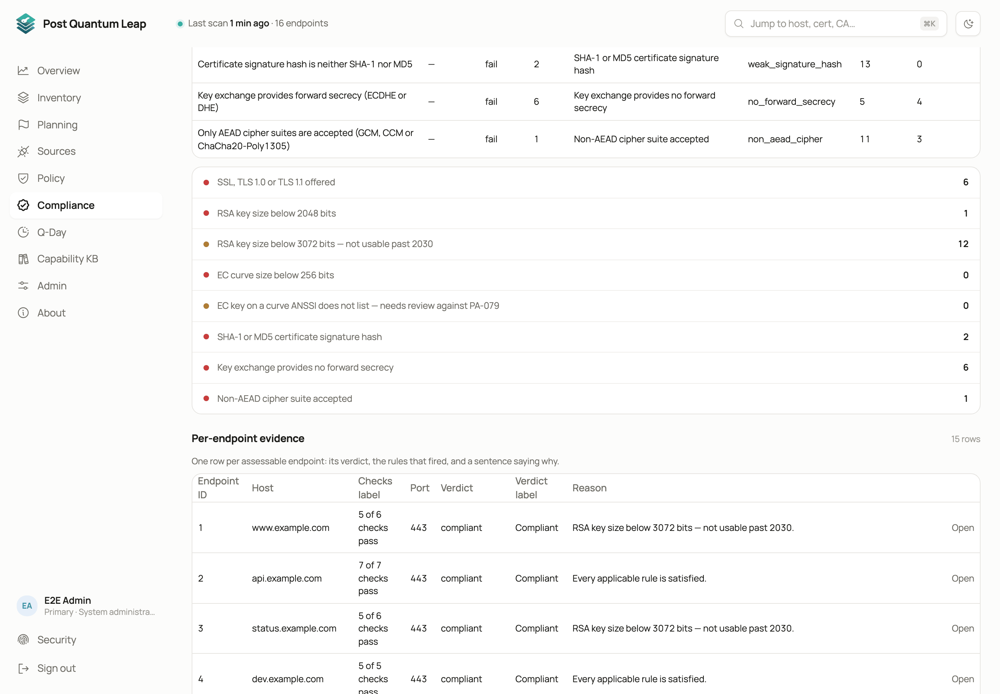
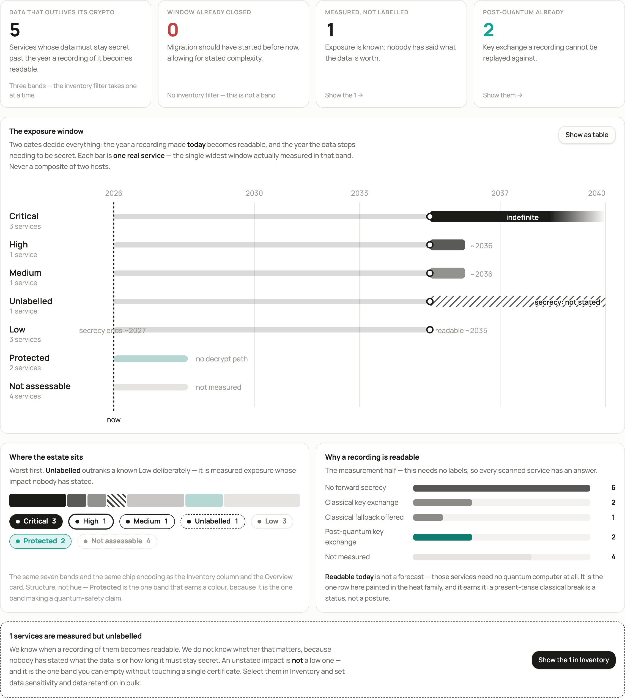

# Compliance

A read-only view of the fleet against named external frameworks. Each report
applies that framework's own rules, not your policy, and names the rule behind
every verdict.
**Who:** every signed-in role.

## The frameworks

| Report | Measures |
|---|---|
| **NIST PQC** (FIPS 203, 204, 205) | Readiness against the standardised post-quantum algorithms. |
| **CNSA 2.0** | The NSA's migration timeline for national security systems. |
| **BSI TR-02102** | The German federal guideline: a fixed technical minimum. |
| **NIST IR 8547** | A transition map. Every endpoint placed against the 2030 deprecation and 2035 disallowed dates. The headline is the nearest date you must budget for. |
| **PCI DSS 4.0** | The transmission requirements a handshake can show (Req. 4.2.1 and strong cryptography). Nothing about segmentation, storage or key management. |
| **FIPS 140-3** | Whether the observed algorithms are FIPS-approved. It cannot tell whether a CMVP-validated module is in use; no handshake reveals that. |
| **ANSSI** | The French recommendations: TLS 1.2 minimum, forward secrecy and AEAD required. |
| **MAS TRM** | The Monetary Authority of Singapore's guidelines, read with industry-accepted key-length floors. |
| **FINMA Guidance 05/2026** | The Swiss supervisory notice on quantum computing. A guidance, not a circular, so its quantum rules warn and never fail. See [the FINMA report](advanced/finma-05-2026.md). |
| **DORA** | The EU regulation and its RTS. Binding law, so classical defects fail. See [the DORA report](advanced/dora.md). |
| **Harvest now, decrypt later** | PQL's own exposure view: how long recorded traffic stays readable, by data sensitivity and retention. |

They measure different things. Do not expect their numbers to agree.

## Reading a card

Each card shows a headline figure, a readiness meter, two or three key facts,
one sentence on what the report actually measures, **Open report** and an
**Excel** export.

## Inside a report

Every report ends with **Per-endpoint evidence**: one row per endpoint, the
values the verdict was computed from, and the rule that decided it. This is
how you check a figure rather than believe it.

**Open** on a row takes you to that endpoint. The crumb at the top then leads
back to the report, not to a generic list.

An empty table means no endpoint has an assessable certificate chain yet. That
includes a fleet whose scans all failed. The notice at the top says which.

## The harvest-now-decrypt-later view

Recorded traffic can be decrypted later, once a quantum computer exists. This
report asks how long your data must stay confidential and whether the key
exchange protecting it will hold that long. It needs two governance labels on
each endpoint, **data sensitivity** and **data retention**. An endpoint without
them is excluded, not failed, and the report says how many are unlabelled.

## What no report can tell you

- Whether your inventory is complete. A perfect score over half an estate is worth nothing.
- Anything about data at rest, key management, HSMs or code-signing keys. A scan sees one listening socket.
- Whether an endpoint is outsourced. Your data centre and your cloud provider present the same handshake.

Each report lists its own limits in plain words.

## See also

- [Policy](08-policy.md)
- [The FINMA report](advanced/finma-05-2026.md)
- [The DORA report](advanced/dora.md)
- [Governance attributes](12-governance.md)
