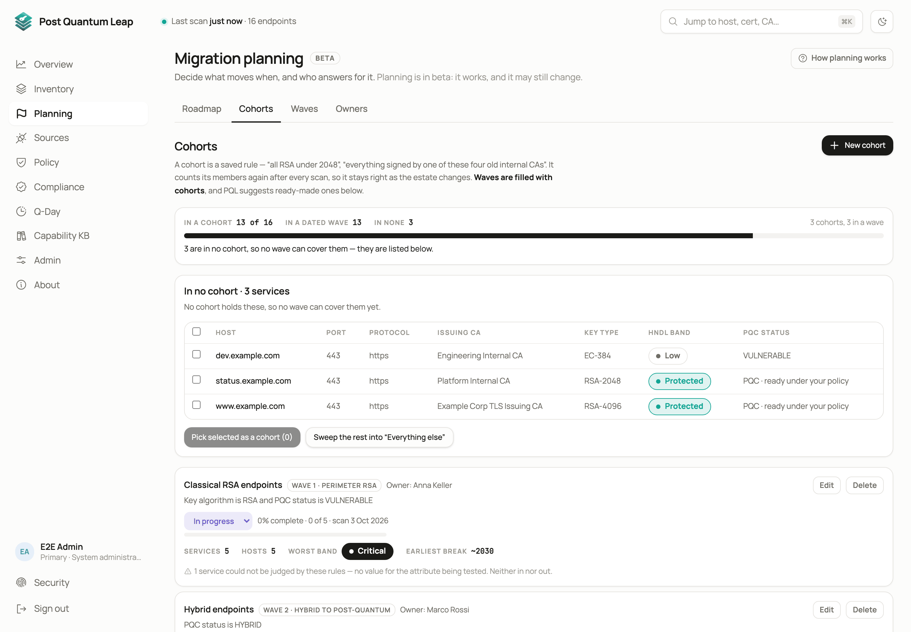
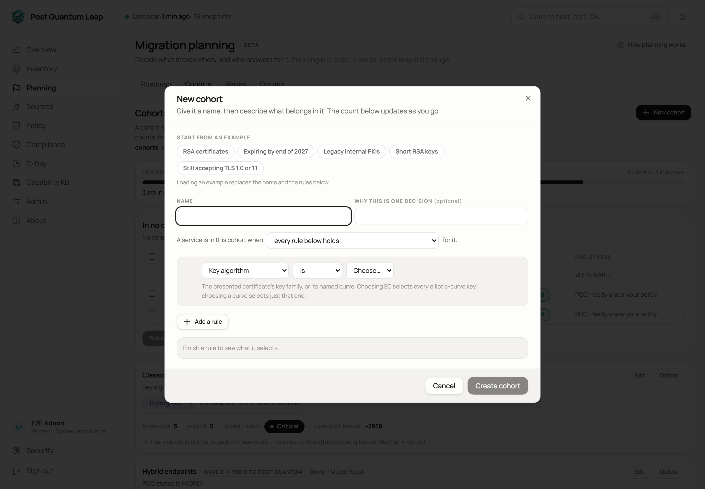
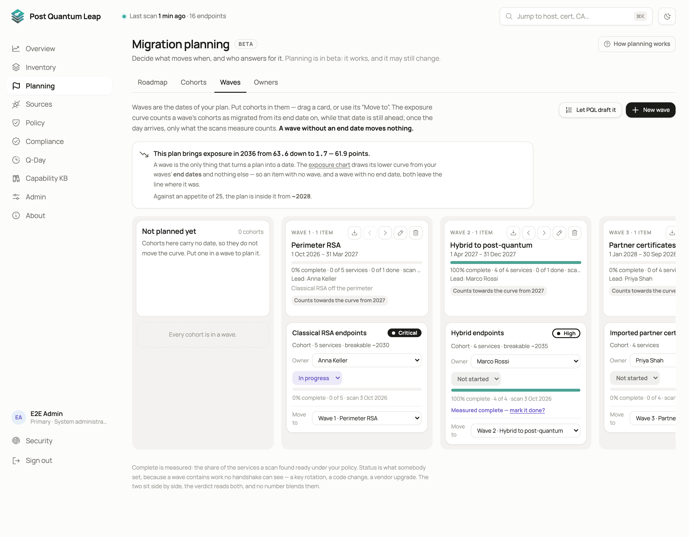

# Planning

Decide what moves when, and who answers for it. Planning turns findings into
cohorts (pieces of work), puts them into dated waves with an owner each, and
shows how far the plan lowers your exposure against the risk appetite you set.
**Who:** PKI Operator and System Administrator plan. Readers view.

**Planning** has four tabs: **Roadmap**, **Cohorts**, **Waves** and **Owners**.
**How planning works**, top right, opens a short in-app explanation.

## The three pieces

| Piece | What it is |
|---|---|
| **Cohort** | A saved rule, such as "all RSA under 2048" or "everything signed by one of these four internal CAs". It counts its members again after every scan, so it stays right as the estate changes. A cohort can also be a hand-picked list of services. |
| **Wave** | A dated block of work with a lead owner and a goal. Waves are filled with cohorts. |
| **Owner** | A person who answers for a wave or a cohort: name, title, e-mail. People, not teams. |

## Cohorts

The counters at the top say how many services are **in a cohort**, **in a dated
wave** and **in none**. A service in none is one no wave can cover yet; the
panel below lists them. Tick some and **Pick selected as a cohort**, or
**Sweep the rest into "Everything else"**.

**New cohort** opens the builder. Write rules on attributes such as key
algorithm, key size, issuing CA, post-quantum status, source, protocol or your
governance attributes, and choose whether a service must match all rules or
any. Or paste `host:port` lines under **Selected services** for a hand-picked
cohort. The page shows how many services match before you save.

**Suggested by PQL**, further down, groups the estate by certificate authority,
algorithm, library and business service. Each card is a ready-made rule;
**Adopt as cohort** turns it into one.

Each cohort card shows its wave and owner, a status you set (**Not started**,
**In progress**, **Done**), how many of its services are ready under your
policy, the worst exposure band and the earliest estimated break year.

## Waves

The Waves board has one column per wave. Cards are cohorts; drag one to
another wave. **New wave** asks for a name, start and end dates, a goal and a
lead owner.

**Let PQL draft it** does two things, and saves nothing until you apply:

1. Proposes cohorts from the services that are not ready under your policy and in no cohort yet, grouped by issuing CA and key type, self-signed certificates first. Tick, rename, split or merge them.
2. Puts your cohorts and the proposals you kept in order, highest risk first, into waves.

**Apply** creates what you ticked. **Undo** on the board removes it again.
The rules behind the draft are in [Planning in detail](advanced/planning-details.md).

## The Roadmap

- **Roadmap.** The waves on a timeline, with their leads. **Plan**, **5 years** and **10 years** zoom it.
- **Needs attention.** What stops the plan from moving the line: an undated wave, a wave with no owner, services in no cohort. Each line links to the fix.
- **Risk against appetite.** Today's exposure, your appetite, the year the plan gets inside it, and two curves: do nothing, and the current plan. The unit is a weighted exposure score out of 100. It is PQL's own model, not a standard, and its years are estimates.
- **The line this tenant draws.** Set the appetite (0 to 100) and **Save**, or **Publish no threshold**.

What a wave does to the curve:

- An item in no wave moves nothing.
- An undated wave moves nothing.
- A wave counts until its end date arrives, then the curve shows what the scans measure. Re-date it, or mark the work done.
- The exposure bands need two labels on each host, data sensitivity and retention ([Governance attributes](12-governance.md)). Unlabelled hosts are counted as excluded, not folded into either curve.

## Taking it to the board

**Board deck** on the Overview builds a PowerPoint deck from your tenant's own
scan data: posture, what changed, the plan. A preset fills in the slide list;
every tick is yours to change. A System Administrator can upload your own
template under **Admin → Board reporting** so the deck carries your branding.

## See also

- [Planning in detail](advanced/planning-details.md): the draft's rules, issuing CA groups, the Cohorts tab counts, declared services
- [Governance attributes](12-governance.md)
- [Compliance](09-compliance.md), the harvest-now-decrypt-later view
