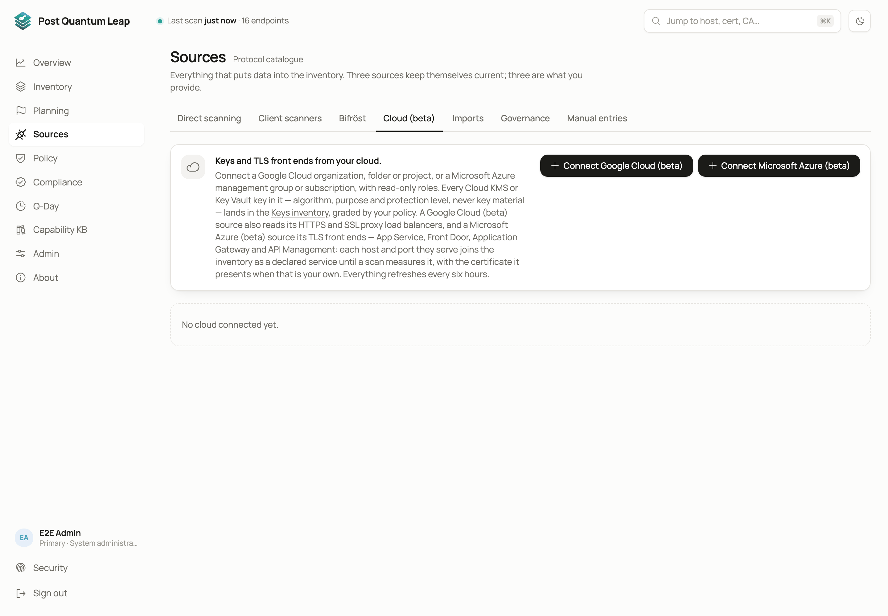

# Cloud discovery (beta)

A key that wraps a database or signs a build never appears in a handshake, so
no scan finds it. A cloud source reads keys where they live, Google Cloud KMS
and Azure Key Vault, into the Inventory's **Keys** view. It also reads the TLS
configuration of your load balancers and TLS front ends.
**Who:** System Administrator to connect or change a source. PKI Operator to
watch sources and press **Sync now**.

## Before you start

- The connector is in beta and says so wherever it is named.
- Your tenant needs the **Cloud discovery (beta)** capability, switched on in the [Platform console](14-platform-console.md) and named in your licence. Without it the tab says why.
- Reads are metadata only: algorithm, size or curve, HSM or software, what a key may be used for. Never key material.
- Sources refresh every six hours. **Sync now** runs one at once.

## What a source reads

| Source | Keys | TLS configuration |
|---|---|---|
| **Google Cloud** | Cloud KMS keys in an organisation, folder or project | HTTPS and SSL proxy load balancers: host names and ports, SSL policy, post-quantum key-exchange setting, the certificate they are configured to present |
| **Microsoft Azure** | Key Vault keys in a management group or subscription, the current version of each | App Service, Front Door, Application Gateway and API Management: host names and ports, minimum TLS version and cipher policy, Front Door's post-quantum setting, the certificate each is configured with |

## Connecting Google Cloud

1. **Connect Google Cloud (beta)**. Name the source and choose the scope.
2. Workload identity federation is the default: no Google key is created or stored. Copy or download the script and run it in Cloud Shell as `PROJECT=<project for the pool> bash pql-federation.sh`.
3. Paste the workload identity provider it prints and press **Save, turn on and sync**.

A service-account key is offered as the discouraged fallback.

## Connecting Microsoft Azure

1. **Connect Microsoft Azure (beta)**. Name the source, choose a management group or a subscription, and how it signs in. **Certificate** is recommended: PQL makes its own certificate and only the public half goes to your directory. **Client secret** is for a directory whose policy refuses a self-signed certificate.
2. Press **Create and set up**, then **Copy** or **Download** the script and run it in Azure Cloud Shell as a file: `bash pql-azure.sh`. Run it as somebody who may create app registrations and assign roles on the scope. It creates an app registration and read-only roles, and never writes to a vault.
3. Paste back the directory (tenant) ID and application (client) ID it prints, and press **Save, turn on and sync**. **Later** leaves the source off; **Finish setup** on its card reopens this step.

A role assignment can take up to ten minutes to apply, so the first sync may
read nothing. Sync again shortly.

The certificate is valid for one year. The source warns from 30 days before it
expires; **Renew certificate** on the source walks you through it.

## Declared services

Each host name and port a load balancer or front end serves becomes a
**declared** service: in the Inventory, marked **Declared (cloud)**, but
measured by nothing yet. The first scan that completes a handshake with it
makes it an ordinary measured service. **Rescan**, **Scan all targets** and
the schedule dial it. One the server cannot reach, such as an internal load
balancer or an app behind private endpoints, needs a
[Bifröst remote engine](07-remote-engines.md).

A declared service is in no figure: the Overview, grades, compliance reports
and scan history count only what was measured. It is in your plan, marked
*Declared, not measured*.

While a source is on, a service it declares cannot be deleted; remove it in
the cloud, or change the source. When a complete read no longer finds a
service, it is marked not found and removed 12 hours later, unless a scan has
measured it or a person set something on it.

## Reading the source's card

Each source shows when it last synced, what it read, and any notes: vaults it
could not read, permissions its role lacks, certificates waiting to be
uploaded. A note is never an error; the sync completed without that part. A
warning means something went wrong that was not a permission, and what was
read before is kept.

## Removing a source

**Delete** removes the source and every key it read, and releases the
services it declared. What the setup script created in your cloud stays: the
confirmation names what to remove by hand.

## See also

- [Microsoft Azure sources in detail](advanced/azure-sync-details.md)
- [Cloud configuration compared with scans](advanced/configuration-vs-scan.md)
- [The Inventory](03-inventory.md), Keys view
