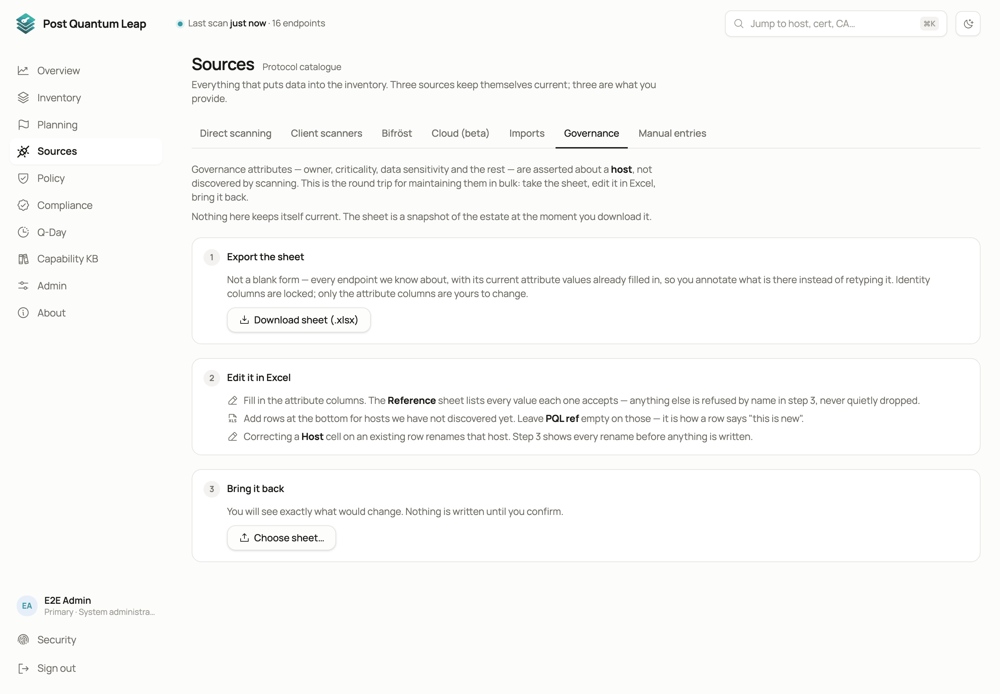
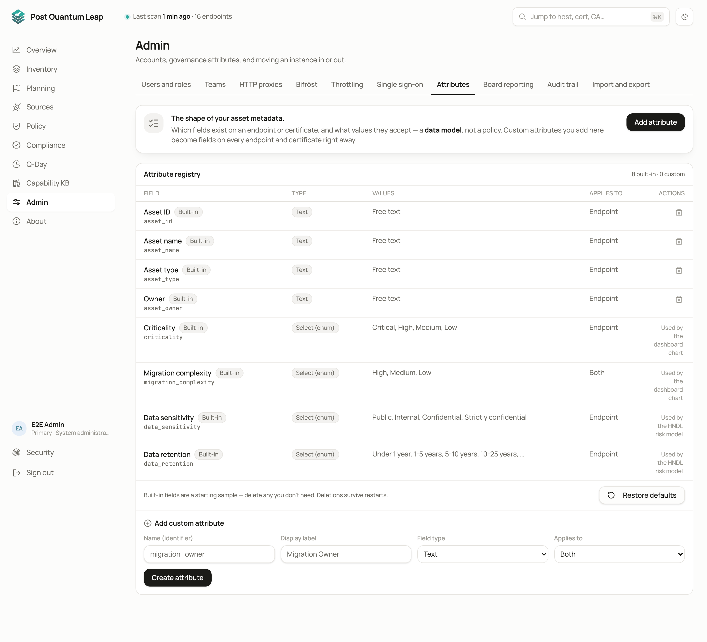

# Governance attributes

Beyond the cryptographic facts, every endpoint carries attributes that
describe your organisation: who owns it, how critical it is, how hard it will
be to migrate. They become filters, report dimensions and planning rules.
**Who:** PKI Operator to set values. System Administrator to change the fields.

## The fields

Six ship with a fresh install.

| Field | Used by |
|---|---|
| **Asset owner** | The Teams tab's counts, filters, exports |
| **Asset type**, **Asset name**, **Asset ID** | Filters and exports |
| **Criticality** | The Overview's backlog heatmap, the FINMA and DORA reports, planning |
| **Migration complexity** | The Overview's backlog heatmap |

Two more matter for the exposure model: **data sensitivity** and
**data retention**. The harvest-now-decrypt-later report and the Roadmap's
exposure curve read them, and an endpoint without them is excluded from both.

Attributes belong to the endpoint, so they survive certificate rotation.

## Setting values

- **One endpoint.** Open its page and edit the **Governance** section.
- **Several.** Tick them in the Inventory and use the bulk governance action.
- **The whole fleet.** **Sources → Governance** exports an Excel sheet of every endpoint with its attributes, you fill it in, and you bring it back. Add rows at the bottom for hosts not yet discovered.

## Changing the fields

**Admin → Attributes** is where a System Administrator shapes the model: add
your own fields with their own options, and delete the ones you do not use,
the six shipped ones included.

Two things to know before deleting a field:

- Deleting it removes every value stored under it, on every endpoint and certificate. The confirmation says how many hold a value. There is no undo, and the values are gone from exports too.
- **Restore defaults** brings back any shipped field that is missing and resets the rest to their shipped names and options. It restores fields, never data. Your own fields are left alone.

## Where attributes show up

- Inventory filters and the **Governance** column view
- Excel exports
- The FINMA and DORA reports, which read **Criticality** and data sensitivity and say so
- Cohort rules in [Planning](10-planning.md)

## See also

- [Admin](13-admin.md)
- [Planning](10-planning.md)
