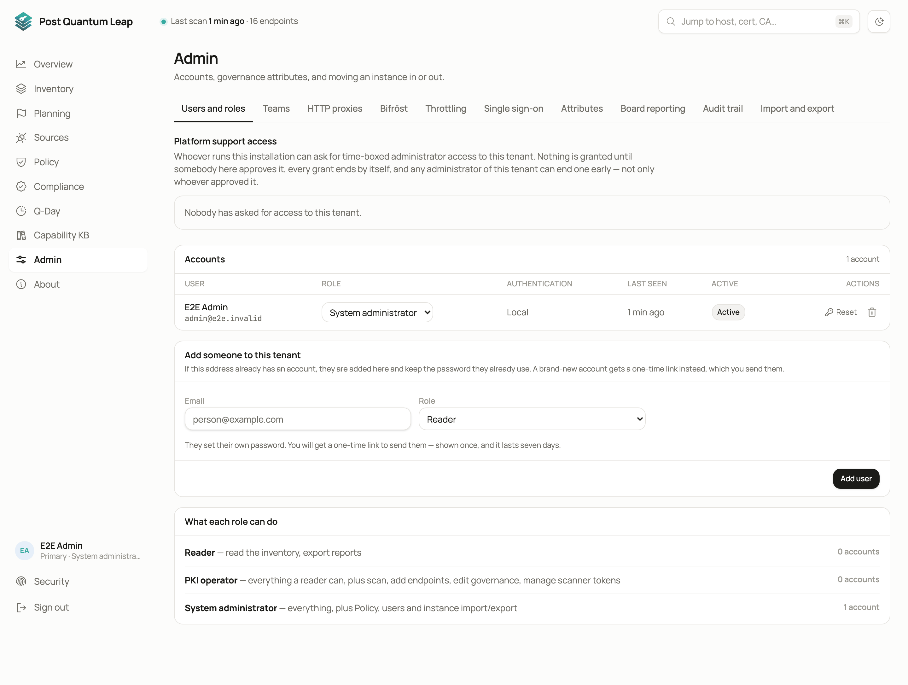
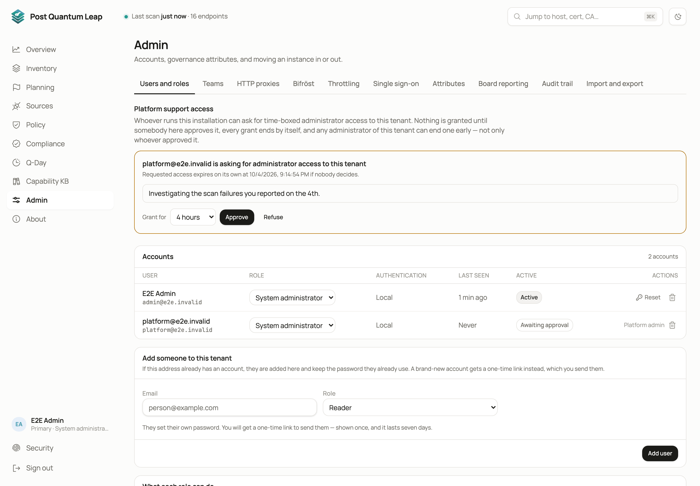
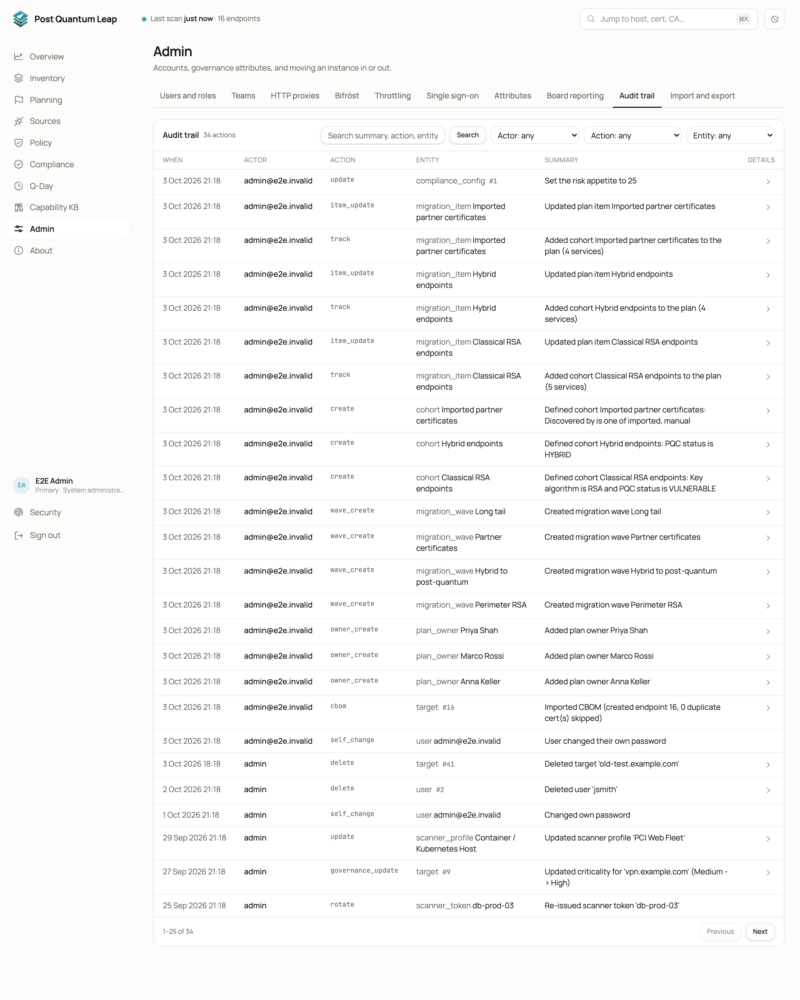
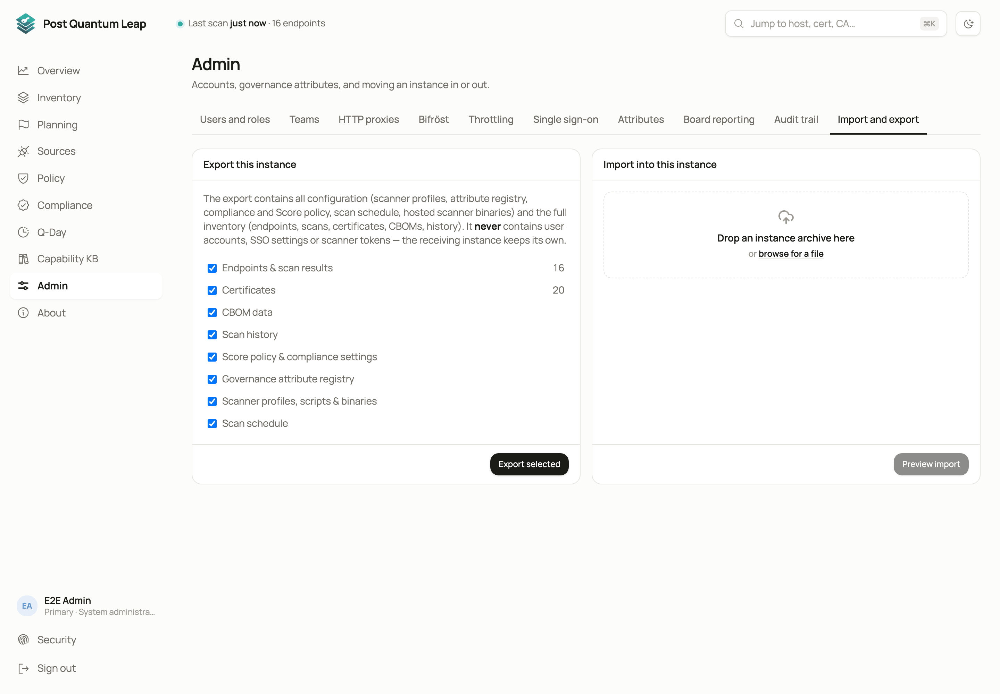

# Admin

Your tenant's own settings. Nothing here reaches another tenant.
**Who:** System Administrator of this tenant.

| Tab | What it holds |
|---|---|
| **Users and roles** | The people in this tenant and what each may do |
| **Teams** | Groups for ownership and filtering |
| **HTTP proxies** | Named proxies that targets and the schedule refer to |
| **Bifröst** | A pointer to the engines on Sources |
| **Throttling** | Named speed profiles for scans |
| **Single sign-on** | A pointer to the providers in the Platform console |
| **Attributes** | The governance model ([Governance attributes](12-governance.md)) |
| **Board reporting** | The template the board deck is built from |
| **Audit trail** | Every configuration change |
| **Import and export** | Move this tenant's data to another installation |

## Adding people

On **Users and roles**, enter an e-mail address, choose a role and **Add user**.

- Somebody who already has an account on this installation gets a membership and keeps their credential.
- A new account gets a **one-time setup link**. Copy it and send it; it is not stored anywhere you can read back.

Nobody, including you, ever sees another person's password. **Reset** issues a
fresh link and clears the old credential at once. For somebody who uses
passkeys the button reads **Reset sign-in…** and asks a few questions first;
see [Platform console: settings in detail](advanced/platform-settings.md).

The **Authentication** column says how each account signs in: local, local
with a passkey, local with a passkey required, or its single sign-on provider.
An account that administers the installation cannot be reset from here.

## Roles

| Role | Can do |
|---|---|
| **Reader** | View everything, export the filtered inventory |
| **PKI Operator** | Add and edit endpoints, scan, import, record manual entries, set up scanners and engines, edit governance attributes, plan |
| **System Administrator** | All of the above, plus everything on this page, the scan schedule, Policy, scanner tokens and binaries, cloud sources |

## Platform support access

At the top of **Users and roles** you may find a request from whoever runs the
installation, asking for time-boxed administrator access to your tenant.
Nothing is granted until you approve it. You see their reason exactly as they
wrote it, you choose the window (1 to 72 hours), and any administrator of your
tenant can end it early with **End access now**. **Refuse** grants nothing.

## Proxies and throttling

Both are named definitions you refer to elsewhere rather than retype. A target
or the schedule names a proxy; a throttling profile sets how fast scans run so
an intrusion detection system does not read them as an attack.

## Audit trail

Every configuration change with who did it, when, the values before and after,
and a plain-English summary. Search and filter it.

## Import and export

**Export** downloads one file with this tenant's configuration and inventory.
It never contains user accounts, passkeys, recovery codes, single sign-on
settings or scanner tokens.

**Import** loads such a file into another instance. **Merge** adds and updates
and deletes nothing. **Replace** wipes this tenant's configuration and
inventory first; you type `replace` to confirm.

## See also

- [Signing in and roles](01-signing-in.md)
- [Platform console](14-platform-console.md)
- [Platform console: settings in detail](advanced/platform-settings.md), resetting a sign-in
