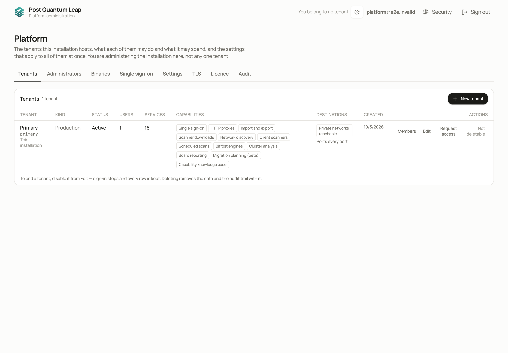
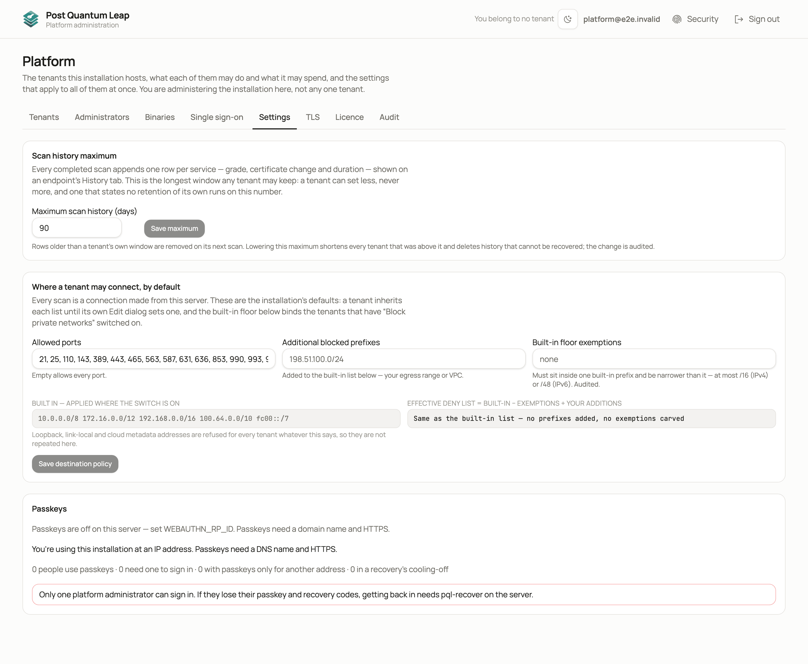
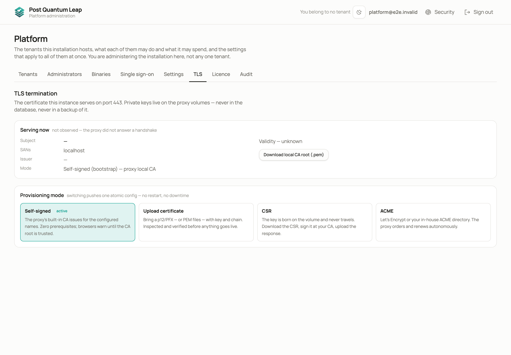
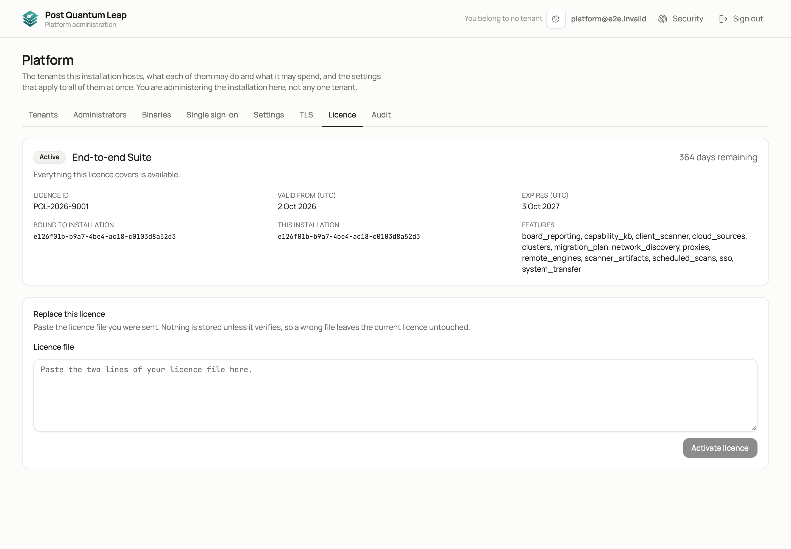

# Platform console

The console administers the installation: every tenant it hosts, who
administers it, its own TLS certificate, the licence and single sign-on.
**Who:** platform administrators only.

The console is its own mode. It shows nothing that belongs to a single tenant.
If you also belong to a tenant, a control in the header takes you into it, and
**Back to Platform console** at the foot of the tenant's rail brings you back.
The first account created at installation is a platform administrator with no
tenant membership, so it lands here.

## Tenants

One row per tenant: kind, status, how many users and services it holds, its
capabilities, where it may connect, and when it was created.

| Action | What it does |
|---|---|
| **New tenant** | Creates one from a preset, showing every value before anything is created. |
| **Members** | Manages that tenant's people. This is how a new tenant gets its first administrator: add the address and copy the one-time setup link. |
| **Edit** | Limits, capabilities (such as Cloud discovery), where it may connect, isolation, active or disabled. |
| **Request access** | Asks that tenant for time-boxed administrator access. It grants nothing by itself; the tenant approves or refuses. |

Disabling a tenant stops sign-in and keeps every row. Deleting removes the
data and its audit trail.

## Administrators

Who administers the installation. **Add administrator** grants the flag to an
account that already signs in here. **Setup link** issues a one-time password
link for another administrator. **Remove** clears the flag and nothing else;
it is refused on yourself and when nobody else could still sign in.

## Settings

- **Scan history maximum.** The longest history any tenant may keep.
- **Where a tenant may connect.** The default allowed ports and blocked prefixes for scans. Loopback, link-local and cloud metadata addresses are always refused.
- **Passkeys.** Off, optional, or required once set up; and what a recovery code lets somebody do.
- **SSO providers.** Entra ID or any OpenID Connect provider, each bound to one tenant or installation-wide. Local sign-in stays available beside them.

Each setting, what to choose and what changing it does are in
[Platform console: settings in detail](advanced/platform-settings.md).

## TLS

The server's own certificate, configured here rather than in a file. The
status card reports the certificate observed on the wire: the server
handshakes its own address with the same scanner it points at everything else.

On first boot the server presents a certificate from its own local CA, which
browsers warn about. Two ways to deal with that, and only one is permanent:

- **Verify the fingerprint** shown here against your browser's.
- **Download local CA root (.pem)** and install it where this server should be trusted. The warning goes for good.

For a real certificate choose a provisioning mode: upload your own, generate a
certificate signing request, or let the server obtain one through ACME. Every
upload is inspected before it is served.

## Licence

Paste the licence file you were sent. A licence binds itself to the first
installation that uses it; there is no installation ID to send anybody. The
tab shows what the installation is licensed for and when it expires. Signing in
and this page work in every licence state, so a lapsed installation can always
be renewed. An expiring licence warns for 30 days, keeps working for 14 days
after expiry, then becomes read-only. Your data is never taken away.

## See also

- [Platform console: settings in detail](advanced/platform-settings.md)
- [Admin](13-admin.md)
- [Installation guide](../../README.md)
