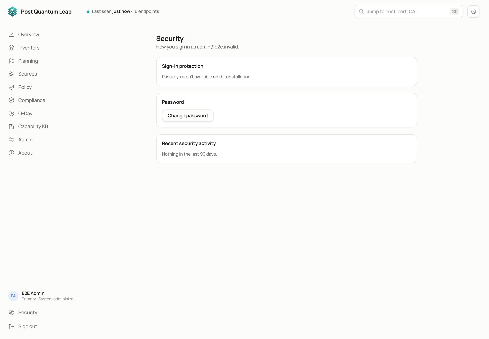

# Your account

How you sign in, and how to change it.
**Who:** everyone.

## Security

**Security**, next to **Sign out** in the left rail, shows how your account is
protected: whether a passkey guards it, your passkeys, your recovery codes,
your password, and the last 90 days of security activity.

| Action | What it does |
|---|---|
| **Add a passkey** | Signs you in with your fingerprint, face, device PIN or a security key. On an installation that requires passkeys, the first one leads to your recovery codes. |
| **Rename** and **Remove** | Removing your last passkey lets your password alone sign you in again and deletes your recovery codes. |
| **Create new codes** | The new set replaces the old one once you have saved it. |
| **Change password** | Your current password, or a passkey if your account requires one, then the new one. |

An account that signs in through single sign-on is protected by its identity
provider and has nothing to change here.

## Security notices

When something changes how you sign in (a passkey added or removed, a recovery
code used, your sign-in reset), you are told at your next sign-in and in a
banner. **This was me** dismisses it. If it was not you, **Review passkeys** or
**Change password** straight away.

## Confirm it's you

Changes that affect who can sign in or what they may do ask you to confirm
when you have not signed in or confirmed in the last 10 minutes: adding people
and changing roles, resets and setup links, providers, tokens, certificates,
the installation's settings, your own passkeys and password. The dialog offers
what your account can use: your passkey, your password, or your identity
provider. **Cancel** changes nothing.

## About

**About** shows the running version, release and build, and licensing
information. Include the version in any support request.

## See also

- [Passkeys and recovery codes](advanced/passkeys-and-recovery.md)
- [Signing in and roles](01-signing-in.md)
