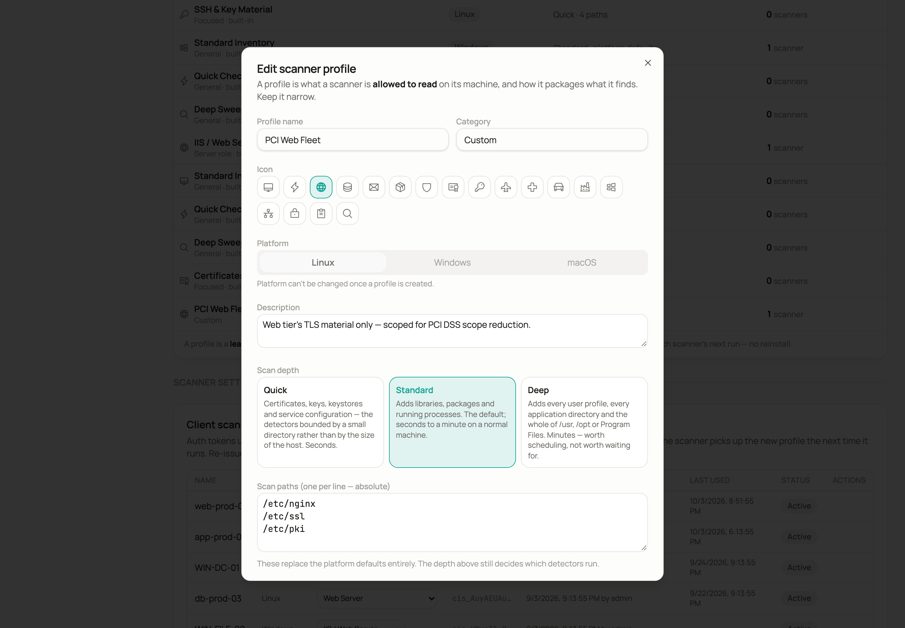

# Client scanners in detail

This page covers scanner profiles, what the client scanner reads on Windows, restricted PowerShell policies, schedules that keep a host reporting, and tokens. You need it once a scanner from [Client scanners](../06-host-scanners.md) is working in Post Quantum Leap (PQL) and you want to tune or automate it.

**Who:** PKI Operator to run scans. System Administrator for profiles, scanner binaries, signed scripts and tokens.

## Scanner profiles

Every scan runs under a scanner profile. A profile answers two questions: how deep to look, and where. Depth decides which detectors run, and it is the setting that changes the result most.

| Depth | What it reads | How long it takes |
| --- | --- | --- |
| **Quick** | Certificates, keys, keystores, service configuration | Seconds |
| **Standard** | Everything in Quick, plus libraries, packages and processes | Seconds to a minute |
| **Deep** | Everything in Standard, plus every user profile, every application directory, and all of `/usr`, `/opt` or Program Files | Minutes |

Paths narrow or widen where those detectors look. An empty path list is the normal case, not an unfinished form. The scanner applies the depth preset first and only overrides its paths when the profile names some. An empty list means "wherever this platform keeps crypto material", resolved on the host against its own environment, which a written-down list cannot do:

| Platform | What an empty path list reads |
| --- | --- |
| Windows | `%ProgramData%\ssh`, the CNG key containers, IIS configuration and the JDK truststores under `%LOCALAPPDATA%` |
| macOS | `/etc/ssl/cert.pem`, the Homebrew prefixes and `/Library/Java` |
| Linux | `/etc`, `/usr/bin` and `/usr/local` |

Eighteen profiles ship with PQL, grouped by role:

| Group | Profiles | Platform |
| --- | --- | --- |
| General | *Standard Inventory* (the default), *Quick Check*, *Deep Sweep*. These name no paths, so they suit any host of their platform | One set each for Linux, Windows and macOS |
| Server role | *Web Server*, *Database Server*, *Mail / Messaging Server*, *Container / Kubernetes Host*, *VPN / Network Appliance* | Linux |
| Server role | *IIS / Web Server* | Windows |
| Focused | *Certificates & Trust Stores*, *SSH & Key Material* | Linux |
| Focused | *Certificates & Trust Stores* | macOS |

The **Scanner profiles** table sits directly under the scanners table on **Sources → Client scanners**. Its columns are Profile, Platform, Reads and In use. **Reads** sums up the profile as depth plus paths, for example *Standard · 8 paths* or *Quick · platform defaults*. **In use** counts the scanners currently pointed at the profile.

Built-in profiles are read-only. A System Administrator can create a custom profile, edit or delete a custom profile, and duplicate a built-in profile to change the copy. Duplicating a built-in is the way to start from a known-good baseline.

Creating or editing a custom profile opens a form with the scan depth, the scan paths, the exclude paths, the CycloneDX version and the privacy setting.



- Leaving the scan-path box empty is normal. The form names what the platform reads instead.
- **Exclude paths** are skipped even when a scan path contains them. Use them to keep a deep sweep out of `/var/lib/docker/overlay2` or `C:\Windows\WinSxS`.
- The platform is locked, on an edit and on a duplicate. A profile's platform decides what its paths mean: `C:\ProgramData\ssh` is not a path on a Mac. Switching the platform on a copy would discard the paths that were the reason to copy it. To make a profile for another platform, duplicate that platform's own built-in.

## Scanner binaries

PQL bundles all four Linux builds of the scanner, so ARM64, ARMv7 and RISC-V hosts install with the same one-line command as any other Linux host. The binary is statically linked and needs no interpreter, so it also runs on Alpine and other musl-based hosts. A System Administrator can upload a replacement binary for any platform under **Sources → Client scanners → Scanner binaries**, for example a custom build. An uploaded binary takes precedence over the bundled one.

## What the scanner reads on Windows

Windows runs the same scanner as Linux: a native Windows binary (amd64 or arm64), fetched by a small PowerShell bootstrap. Run it in an elevated PowerShell. The install command, and its remote form over PowerShell Remoting, are in [Client scanners](../06-host-scanners.md).

Being the same scanner matters for what it can see:

- Certificate stores are read from the registry, not through the store API. That is the only way to reach service-owned stores.
- It finds certificate-to-service bindings for IIS, HTTP.SYS, RDP, WinRM and SQL Server.
- It finds Java keystores, PKCS#12 files, and Firefox and Thunderbird NSS databases.
- It inventories the enabled TLS protocols and cipher suites (SCHANNEL) and the running services that matter for cryptography.

It submits the same CBOM shape as the Linux scanner, so the host lands in the same Inventory with the same crypto graph and PQC rating. Nothing is installed and nothing is written to disk.

Certificates a client scanner finds on a host, in the Windows stores or anywhere else, are independent certificates, not a TLS chain. Instead of *Leaf* and *Chain [n]*, the Inventory and the certificate detail view classify each one by its role. The role is read from the certificate's extensions (Basic Constraints CA and the Certificate Signing key usage):

| Role | Meaning |
| --- | --- |
| **Root CA** | Self-signed CA certificate (subject equals issuer) |
| **Intermediate CA** | CA certificate issued by another CA |
| **Self-signed** | Subject equals issuer, but not a CA (for example Windows workplace-join or device certificates) |
| **Certificate** | An end-entity certificate |

The chain-derived *Issuing CA* and *Root CA* columns in the Inventory stay empty for client-scanner hosts.

## Running under a restricted PowerShell execution policy

The one-line install command pipes the downloaded script straight into PowerShell (`irm` into `iex`). No script file is executed, so PowerShell's script execution policy does not apply. It works under the default `Restricted` policy.

If your organisation blocks `iex` of downloaded content, download the script and run it with a per-process bypass:

```powershell
iwr https://<server>/api/client-scanner/install.ps1 -OutFile pql-scanner.ps1
powershell -ExecutionPolicy Bypass -File .\pql-scanner.ps1 -Server https://<server> -Token cis_XXXX
```

Two equivalents: `Set-ExecutionPolicy -Scope Process Bypass -Force` for the current session, or `Unblock-File` once under `RemoteSigned` to clear the download's mark-of-the-web.

### AllSigned: upload a signed script

When Group Policy enforces `AllSigned`, `-ExecutionPolicy Bypass` is ignored. Only Authenticode-signed scripts from a publisher your hosts trust will run. Sign the script with your own code-signing certificate and let PQL serve your signed copy:

1. Download `pql-scanner.ps1`.
2. Sign it unchanged:

   ```powershell
   Set-AuthenticodeSignature -FilePath .\pql-scanner.ps1 -Certificate $cert -TimestampServer http://timestamp.digicert.com
   ```

3. Upload the signed copy under **Sources → Client scanners → Windows script delivery**.

PQL then serves your signed copy at `/api/client-scanner/install.ps1` byte-for-byte, so the signature stays valid on the endpoints. An upload must be exactly the bundled script plus a signature block. Anything else is rejected. After a PQL upgrade the page flags the signed copy as *outdated* so that you can re-sign the new version.

## Keeping a host reporting

A single run is a snapshot. Every install command is a one-shot run: the bootstrap works from a temporary directory and removes the binary on every exit path. Nothing stays installed, and PQL never needs SSH credentials. To keep a host's posture current, register a daily job on the host.

You do not have to write the job by hand. The wizard's **Verify** step prints the command for the platform you picked, with your server URL, token, profile and trust flags already filled in. Copy it and run it on the host. The commands below are what **Verify** prints when the command runs on the host itself. If you chose **From another machine** under **Where it runs**, Verify wraps the same commands, removal included, in `ssh` or `Invoke-Command`. You run them from your jump host or admin workstation, and the job is still installed on the target.

**How often**, a control on the Verify step beside the command, offers four choices. All are anchored at 02:00, so every one of them runs overnight.

| Choice | Runs at |
| --- | --- |
| **Daily** (default) | Every day at 02:00 |
| **Twice a day** | 02:00 and 14:00 |
| **Every 6 hours** | 02:00, 08:00, 14:00 and 20:00 |
| **Weekly** | Sundays at 02:00 |

Changing the choice rewrites the command underneath. It changes nothing else. PQL does not store the choice. The scanners table does not claim a host is on a given schedule, because nothing reports back what a host actually runs. What you copy is the whole of it. The commands below show the **Daily** default; another choice changes the hour field.

Every schedule command is idempotent: running it a second time replaces the existing job instead of adding a second one. Each job also waits a random delay of up to 30 minutes. A fleet installed from one wizard page therefore does not hit the server on the same minute.

### Linux

The job goes into the user's own crontab, so it needs no `sudo`:

```bash
(crontab -l 2>/dev/null | grep -v '# pql-scanner'; \
  echo '0 2 * * * sleep $(awk -v s=$$ "BEGIN{srand(s);print int(rand()*1800)}"); curl -fsSL https://<server>/api/client-scanner/install.sh | sh -s -- --server https://<server> --token <token> # pql-scanner') | crontab -
```

The `grep -v` on the `# pql-scanner` marker is what makes it idempotent. Each run re-fetches the token's profile, scans and submits.

Linux has no catch-up. Plain cron does not run a job it missed. A machine that is powered off at 02:00 skips that night. Nothing looks wrong except a gap in the host's scan history. macOS and Windows do catch up (below). A systemd timer with `Persistent=true` gives a cron-style job catch-up, but the wizard does not generate one.

### macOS

The job is a LaunchDaemon, not a cron entry:

```bash
sudo tee /Library/LaunchDaemons/com.postquantumleap.scanner.plist >/dev/null <<'PLIST'
<?xml version="1.0" encoding="UTF-8"?>
<!DOCTYPE plist PUBLIC "-//Apple//DTD PLIST 1.0//EN" "http://www.apple.com/DTDs/PropertyList-1.0.dtd">
<plist version="1.0"><dict>
  <key>Label</key><string>com.postquantumleap.scanner</string>
  <key>ProgramArguments</key>
  <array><string>/bin/sh</string><string>-c</string>
    <string>sleep $(awk -v s=$$ 'BEGIN{srand(s);print int(rand()*1800)}'); curl -fsSL https://<server>/api/client-scanner/install.sh | sh -s -- --server https://<server> --token <token></string></array>
  <key>StartCalendarInterval</key><dict><key>Hour</key><integer>2</integer><key>Minute</key><integer>0</integer></dict>
  <key>RunAtLoad</key><false/>
</dict></plist>
PLIST
sudo launchctl bootout system/com.postquantumleap.scanner 2>/dev/null || true
sudo launchctl bootstrap system /Library/LaunchDaemons/com.postquantumleap.scanner.plist
```

Do not schedule a Mac with cron. cron still exists on macOS. A cron job would fire, submit and report success, while reading less than the same scan reads from your terminal. cron holds no Full Disk Access, so a cron-driven scan silently misses the paths a Terminal you have already approved can see. A schedule that quietly scans less than it should is worse than no schedule, because nothing looks wrong. The LaunchDaemon runs as root, is the mechanism Apple documents, and catches up: launchd runs a missed calendar job when the machine next wakes.

### Windows

The job is a Scheduled Task. Run the command from an elevated PowerShell:

```powershell
Register-ScheduledTask -Force -TaskName 'PQL Scanner' `
  -Action (New-ScheduledTaskAction -Execute 'powershell' -Argument '-NoProfile -Command "$env:CIS_SERVER=''https://<server>''; $env:CIS_TOKEN=''<token>''; irm https://<server>/api/client-scanner/install.ps1 | iex; exit $LASTEXITCODE"') `
  -Trigger (New-ScheduledTaskTrigger -Daily -At 2am -RandomDelay (New-TimeSpan -Minutes 30)) `
  -Settings (New-ScheduledTaskSettingsSet -StartWhenAvailable -RunOnlyIfNetworkAvailable) `
  -Principal (New-ScheduledTaskPrincipal -UserId 'SYSTEM' -RunLevel Highest)
```

| Option | Effect |
| --- | --- |
| `-Force` | Re-running updates the task instead of failing on the duplicate name |
| `-StartWhenAvailable` | The catch-up. A laptop asleep at 02:00 scans when it wakes instead of skipping the night |
| `-RunOnlyIfNetworkAvailable` | No run and no meaningless failure while the host is offline. Reaching PQL is the job's whole purpose |
| `; exit $LASTEXITCODE` | Passes the scanner's real exit code to the task, so a failed scan shows as a failed task |

The task pipes `irm` into `iex`, which the script execution policy does not cover, so it works under `Restricted`. Under `AllSigned` the fetch is still allowed, because nothing is executed from a file, so the task runs there too. If your organisation blocks `iex` of downloaded content, point the task's `-Argument` at your uploaded signed `pql-scanner.ps1` on disk (`-ExecutionPolicy AllSigned -File`) instead.

Trust flags carry over. If you installed against a pinned or self-signed relay, the generated schedule carries the same `--pin` or `--insecure` flags as the install line. Without them, every scheduled run against a pinned relay would fail.

## Removing a schedule

The wizard prints the removal commands too. Each is safe to run when nothing is installed, which is usually the state of the host you are reaching for it on.

### Linux

```bash
crontab -l 2>/dev/null | grep -v '# pql-scanner' | crontab -
```

### macOS

```bash
sudo launchctl bootout system/com.postquantumleap.scanner 2>/dev/null || true
sudo rm -f /Library/LaunchDaemons/com.postquantumleap.scanner.plist
```

### Windows

```powershell
Unregister-ScheduledTask -TaskName 'PQL Scanner' -Confirm:$false
```

## Tokens

Every row in the scanners table is a token. The row's ⋯ menu covers day-to-day management: **Change profile**, **Re-issue**, **Revoke** and **Delete**. The **Client scanner tokens** section further down the **Client scanners** tab lists the same tokens for a fuller audit view. It adds two columns: the creator and the exact creation time.

- PQL stores only a SHA-256 hash of each token. The plaintext is shown once, at creation or re-issue.
- A token is pinned to the first host it submits for. After that it can only update that host, so a leaked token cannot overwrite other machines' inventory.
- Use one token per host. One token per fleet is acceptable where the same image is deployed and re-imaged under one identity.
- You can change a token's scanner profile at any time. The scanner re-fetches its profile on every run, so it picks up the new profile the next time it runs. This is how you switch a host from *Standard Inventory* to *Web Server* without touching the endpoint.
- A System Administrator can re-issue (rotate), revoke or delete a token.
- In the **Client scanner tokens** table each token shows its platform, and its assigned profile as an editable dropdown filtered to that platform's profiles.

## See also

- [Client scanners](../06-host-scanners.md): the wizard and the one-line install commands.
- [Remote engines](../07-remote-engines.md) and [Bifröst remote engines in detail](remote-engine-details.md): the relay through which scanners in a segment PQL cannot reach report.
